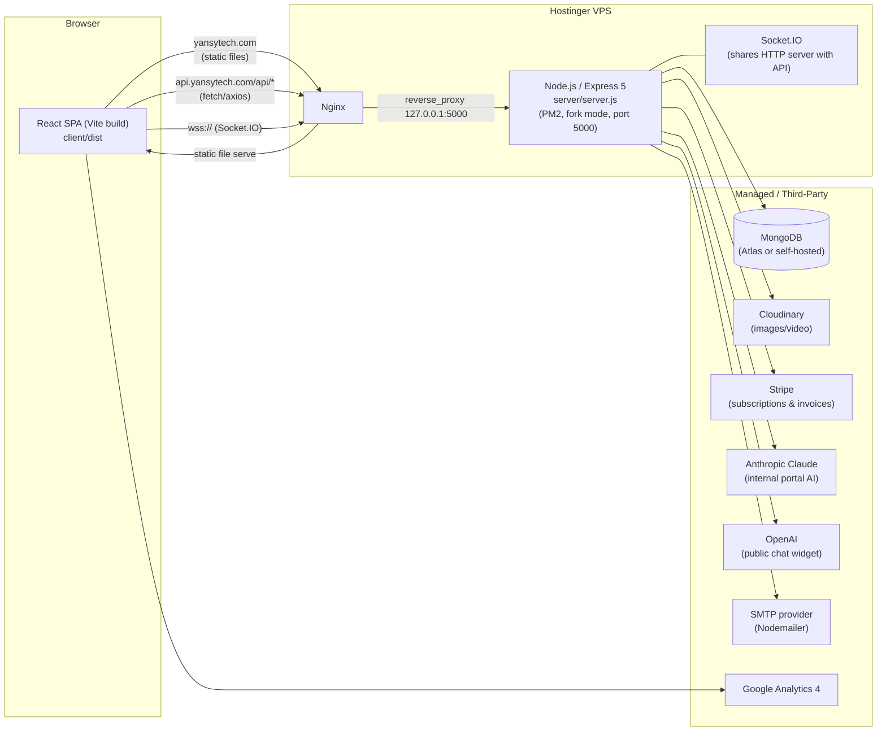
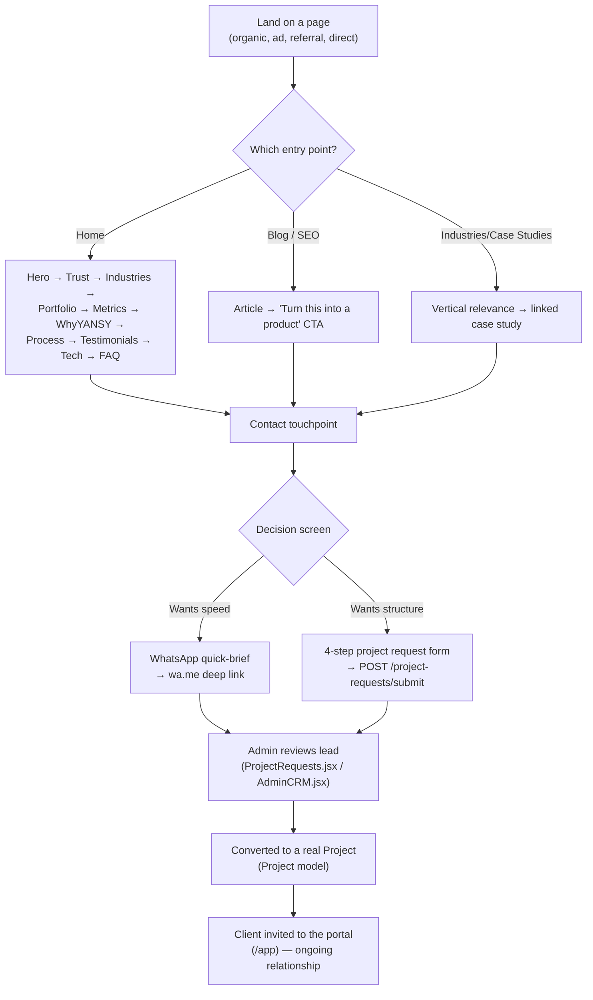

# YANSY Tech — Master Project Documentation

**Status:** Living reference document. Last synchronized against the codebase: **2026-07-24**.
**Scope:** This document describes the repository at `E:\Project Work\videos media🔥❤️\YANSY-V3\YANSY-V3` as it exists today — a public marketing website plus an authenticated client portal and admin panel for a digital product studio called YANSY Tech.

> **How to read this document.** Sections 1–10 describe *what exists*. Sections 11–14 describe *why it exists that way* (business logic, marketing strategy, history). Sections 15–18 are practical (decisions, limitations, how to work in the repo, roadmap). Section 19 is a direct handoff to any future AI assistant. Section 20 is a 5-minute crash course — read that first if you're in a hurry.
>
> Every claim in this document is derived from reading the actual code, configuration files, and the repo's own historical planning documents (`PROJECT_EVOLUTION_PLAN.md`, the `PHASE*_REPORT.md` series, `UX_REPORT.md`, etc.). Where something could not be verified from the repository, it is explicitly labeled **"unverified"** or **"not found in repo"** rather than guessed at.

---

## Table of Contents

1. [Executive Summary](#1-executive-summary)
2. [Project Overview / Architecture](#2-project-overview--architecture)
3. [Features](#3-features)
4. [Pages](#4-pages)
5. [Components](#5-components)
6. [Design System](#6-design-system)
7. [SEO](#7-seo)
8. [Performance](#8-performance)
9. [Accessibility](#9-accessibility)
10. [Internationalization](#10-internationalization)
11. [Business Logic](#11-business-logic)
12. [Marketing Strategy](#12-marketing-strategy)
13. [Content Strategy](#13-content-strategy)
14. [Project Timeline](#14-project-timeline)
15. [Technical Decisions](#15-technical-decisions)
16. [Known Limitations](#16-known-limitations)
17. [Maintenance Guide](#17-maintenance-guide)
18. [Future Roadmap](#18-future-roadmap)
19. [AI Handoff](#19-ai-handoff)
20. [Quick Context (5-Minute Read)](#20-quick-context-5-minute-read)

---

## 1. Executive Summary

### What this project is

YANSY Tech's repository contains **three products in one codebase**:

1. **A public marketing website** (`yansytech.com`) — the lead-generation surface: home page, portfolio, case studies, industries, pricing, blog, contact, and a "why us" page. This is the site a stranger sees before ever becoming a client.
2. **An authenticated client portal** (`/app/*`) — where a signed-up client tracks their project(s), messages the team, views invoices/subscriptions, and manages their account.
3. **An internal admin panel** (`/app/admin/*`) — where YANSY's own team manages users, portfolio content, project requests, feedback, billing, AI usage, system health, and more.

The frontend is a single React SPA (Vite-built); the backend is a single Node/Express API with MongoDB, Socket.IO for real-time features, and third-party integrations for payments (Stripe), file storage (Cloudinary), transactional email (Nodemailer/SMTP), and AI (Anthropic Claude for the internal portal, OpenAI for the public-facing chat widget).

### Who it is for

- **Primary audience of the public site:** business owners in restaurants, clinics/healthcare, real estate, education/academies, hotels/hospitality, manufacturing, startups/SaaS, and e-commerce/retail who need custom software (websites, e-commerce platforms, SaaS products, mobile apps, ERP/CRM systems, booking systems) and are currently underserved by freelancers (unreliable) or generic agencies (slow, expensive, opaque). The market focus is **MENA-first** (Egypt, Saudi Arabia, UAE, Kuwait, Qatar) with full bilingual English/Arabic support, though the positioning is written to work globally.
- **Secondary audience:** existing clients using the portal to track live projects.
- **Internal audience:** YANSY's own team using the admin panel to run the business (leads, projects, billing, support, content).

### Business goals

- Convert website visitors into qualified leads (via WhatsApp, a project-request form, or a free consultation booking) and, ultimately, paying clients.
- Give existing clients a transparent, professional self-service portal (reducing "what's the status of my project?" support load).
- Give the YANSY team a single operational system (CRM-lite, project management, invoicing, support ticketing, content management) instead of scattered tools.

### Competitive positioning

Positioned as a **structured studio**, deliberately contrasted against two alternatives a prospect is likely already considering:
- **Freelancers** — cheap but unpredictable, no backup if they disappear, no formal process.
- **Generic agencies** — reliable but slow, expensive, and often lock clients into their own systems/hosting.

YANSY's stated middle position: *agency-grade structure and reliability, at startup speed and near-freelancer pricing*, with **full client code ownership** (no vendor lock-in) as a recurring, explicit differentiator. This is expressed directly in a "vs." comparison table on the `/why-yansy` page (see [`WhyYANSY.jsx`](client/src/components/WhyYANSY.jsx)).

### Main value proposition

> "We build websites, apps & digital systems for growing businesses" — with **~14 days average delivery**, milestone-based payments (never pay in full upfront), full code ownership after final delivery, and direct access to the people building the product (no account-manager layer).

### Problems it solves

| For the visitor/prospect | For the client (post-signup) | For YANSY internally |
|---|---|---|
| "I don't know if I can trust an agency I found online" → transparent process, real case studies, honest FAQ | "I don't know what's happening with my project" → live progress %, weekly updates, staging access, PM contact | "We have leads, projects, invoices, and support scattered everywhere" → one admin panel |
| "Agencies are opaque about pricing" → public, transparent `/pricing` page | "I can't reach my dev team easily" → in-app + WhatsApp messaging | "We don't know if our AI features are worth the cost" → per-feature AI usage/cost dashboard |
| "What if the freelancer disappears mid-project?" → milestone-based payment model explained in FAQ | "I want to add features later" → owns the code, standard architecture, no lock-in | "We need to track leads through a pipeline" → `AdminCRM.jsx`, `ProjectRequests.jsx` |

---

## 2. Project Overview / Architecture

### High-level architecture



### Frontend
- **Framework:** React 19 + React Router 7 (`client/src/App.jsx` defines all routes)
- **Build tool:** Vite 7 (`client/vite.config.js`)
- **State management:** Redux Toolkit (5 slices — see [Section 5](#redux-store)) for cross-page/authenticated state; React Context for language/theme; local component state for everything else. **There is no persisted Redux store (no redux-persist)** — auth session is rehydrated on boot via a `getMe()` call against the JWT in `localStorage`.
- **Styling:** No CSS framework is used for the public marketing pages — they're hand-styled with **inline `style={}` objects** plus a small set of shared utility classes in `client/src/index.css` (`.btn-primary`, `.card`, `.section-label`, etc.). Tailwind CSS *is* installed and configured (`tailwind.config.js`, PostCSS) and is used more heavily in the authenticated app (`/app/*`) via the `admin-ui` package and various client-portal pages. Both approaches coexist deliberately (see [Section 15](#technical-decisions)).
- **Animation:** GSAP (scroll-triggered reveals, hero entrances) and Framer Motion (page transitions, `AnimatePresence`) — deliberately isolated into separate Vite chunks (`vendor-gsap`, `vendor-motion`) because both are heavy.
- **i18n:** i18next + react-i18next, English/Arabic, full RTL support (see [Section 10](#10-internationalization)).
- **Real-time:** `socket.io-client`, used inside `/app/*` for live messaging, notifications, and admin presence — **not** used on the public marketing site.

### Backend
- **Runtime:** Node.js (no version pinned anywhere in the repo — see [Section 15](#technical-decisions) for the recommendation to fix this).
- **Framework:** Express 5.
- **Database:** MongoDB via Mongoose 9 ODM. Connection string: `MONGODB_URI` env var (legacy `MONGO_URI` also accepted for backward compatibility), defaulting to `mongodb://localhost:27017/yansy` if unset.
- **Real-time:** Socket.IO, sharing the same HTTP server instance as Express (`http.createServer(app)`), authenticated via JWT in the handshake.
- **Auth:** JWT (`jsonwebtoken`), password hashing via `bcryptjs`, Google OAuth via `google-auth-library`. Token is issued on login/register and is used **both** as an httpOnly cookie and returned to the client for `localStorage` (dual-storage — a known, documented compromise, see [Section 15](#technical-decisions)).
- **File storage:** Cloudinary (primary) with a local-disk fallback for development only (`server/utils/cloudStorage.js`); a MongoDB GridFS bucket is also initialized (`server/config/gridfs.js`) but does not appear to be the primary path used by the current upload routes.
- **Payments:** Stripe (`server/utils/stripeService.js`) — subscriptions, checkout sessions, billing portal, webhooks — designed to **degrade gracefully to HTTP 503** rather than crash if Stripe isn't configured.
- **Email:** Nodemailer, SMTP-agnostic, with 12+ transactional templates (verification, welcome, password reset, project updates, invoices, subscription lifecycle emails). Falls back to console-logging if SMTP isn't configured — a deliberate "never block a user action on email" decision.
- **AI:** Two separate integrations for two separate audiences:
  - **Anthropic Claude** (`@anthropic-ai/sdk`, model `claude-sonnet-4-6`) powers *internal, authenticated* AI features (dashboard insights, project briefs, timeline/budget estimation, proposal generation, message/update summarization) — plan-gated and rate-limited per subscription tier.
  - **OpenAI** (raw `axios` calls, default model `gpt-4o-mini`) powers the **public**, unauthenticated AI sales-chat widget (`AIChatWidget.jsx`) and the support-chat endpoint.
- **Security middleware:** Helmet (CSP), CORS (origin allowlist via `CLIENT_URL`), `express-rate-limit` (tiered by endpoint sensitivity), custom NoSQL-injection sanitization (Express 5-compatible, since `req.query` became a getter-only property), custom XSS string sanitization, request-timeout guards, and a DB-availability circuit breaker that returns `503` for all `/api/*` calls if Mongoose isn't connected.

### Database
MongoDB. See [Section 3](#3-features) and the model list below for the full schema inventory. No relational database is used anywhere in this stack.

### Hosting / Deployment
- **Single Hostinger VPS**, not containerized (no Docker/Kubernetes artifacts anywhere in the repo).
- **Process manager:** PM2 (`ecosystem.config.cjs`) — runs the API as a single forked (non-clustered) process named `yansy-api`, auto-restarts on crash or if memory exceeds 500MB.
- **Web server:** Nginx, with a domain split:
  - `yansytech.com` / `www.yansytech.com` → serves the static Vite build (`client/dist`) directly from disk, with a SPA fallback (`try_files ... /index.html`) and 1-year immutable caching on hashed static assets.
  - `api.yansytech.com` → reverse-proxies to `127.0.0.1:5000` (the PM2-managed Node process), with WebSocket upgrade headers for Socket.IO and a generous 24h proxy-read-timeout (to support long-lived SSE/streaming AI responses).
  - HTTPS (Let's Encrypt) server blocks exist in the Nginx config but are **commented out** — see [Section 16](#16-known-limitations).
- **Deploy script:** `deploy/deploy.sh` — builds the client, rsyncs the build to `/var/www/yansytech.com/`, installs server deps, and reloads PM2.

### Folder structure

```
YANSY-V3/
├── client/                      # React/Vite frontend
│   ├── public/                  # Static assets, robots.txt, sitemap.xml, hero images
│   ├── src/
│   │   ├── pages/                # Route-level page components (public + portal + admin)
│   │   ├── components/           # Shared components used across pages
│   │   ├── sections/             # Homepage-specific section components
│   │   ├── admin-ui/             # Self-contained design system for /app (portal + admin)
│   │   ├── contexts/              # LanguageContext, ThemeContext
│   │   ├── store/                 # Redux Toolkit slices
│   │   ├── hooks/                 # Custom hooks (useSEO, useReducedMotion, etc.)
│   │   ├── utils/                 # api.js, analytics, i18n helpers, media helpers
│   │   ├── data/                  # Static content data (blog posts, case studies, process steps)
│   │   ├── constants/              # Shared option lists (project types, budgets, etc.)
│   │   ├── i18n/                   # i18next config + en.json / ar.json locale files
│   │   ├── providers/               # AppProviders composition root
│   │   ├── App.jsx                  # Route table
│   │   └── main.jsx                 # Entry point
│   ├── vite.config.js
│   └── package.json
├── server/                      # Node/Express backend
│   ├── models/                   # Mongoose schemas (23 files)
│   ├── routes/                    # Express routers (23 files)
│   ├── controllers/                # Route handler logic
│   ├── middleware/                  # auth, rate limiting, sanitization, error handling
│   ├── utils/                        # cloudStorage, email, Claude/OpenAI/Stripe services
│   ├── config/                        # gridfs.js
│   ├── scripts/, seeds/                # One-off/maintenance scripts, DB seed data
│   ├── __tests__/                       # Jest + Supertest test suite
│   ├── server.js                         # Entry point
│   └── package.json
├── deploy/                       # deploy.sh, nginx/yansytech.com.conf
├── ecosystem.config.cjs          # PM2 config
├── DEPLOYMENT.md                 # Deployment runbook/history
└── *.md                          # Historical planning/audit reports — see Section 14
```

### Tech stack summary

| Layer | Technology |
|---|---|
| Frontend framework | React 19, React Router 7 |
| Build tool | Vite 7 |
| State | Redux Toolkit + React Context |
| Styling | Inline styles (public site) + Tailwind CSS (authenticated app) |
| Animation | GSAP, Framer Motion |
| i18n | i18next / react-i18next |
| Backend framework | Express 5 (Node.js) |
| Database | MongoDB (Mongoose 9 ODM) |
| Real-time | Socket.IO |
| Auth | JWT + bcryptjs + Google OAuth |
| File storage | Cloudinary (+ local-disk dev fallback, + GridFS present but not primary) |
| Payments | Stripe |
| Email | Nodemailer (SMTP) |
| Internal AI | Anthropic Claude (`claude-sonnet-4-6`) |
| Public chat AI | OpenAI (`gpt-4o-mini`) |
| Process manager | PM2 |
| Web server | Nginx |
| Testing | Jest + Supertest (server only — no frontend test suite found) |
| Analytics | Custom first-party analytics + Google Analytics 4 |

### External services this project depends on
Cloudinary, Stripe, Anthropic API, OpenAI API, an SMTP provider, Google OAuth, Google Analytics 4, Microsoft Clarity (found wired into `client/index.html`), and WhatsApp Business (via `wa.me`/`api.whatsapp.com` deep links — not an API integration, just link-outs).

### Build process
- **Frontend:** `cd client && npm run build` → Vite production build → `client/dist/`. Manual chunking splits vendor code into `vendor-react`, `vendor-state`, `vendor-gsap`, `vendor-motion`, `vendor-i18n`, `vendor-misc`. Target `es2020`, esbuild minification.
- **Backend:** No build step — Node runs `server/server.js` directly (`npm start` / `pm2 start ecosystem.config.cjs`).
- **CI/CD:** No CI pipeline configuration (no `.github/workflows`, no GitLab CI, etc.) was found in the repo — deployment is manual via `deploy/deploy.sh` run on the VPS.

---

## 3. Features

Features are grouped by which of the three "products" (public site / client portal / admin panel) they belong to.

### 3.1 Public marketing site

| Feature | Purpose | Business value | User flow | Key files |
|---|---|---|---|---|
| Cinematic homepage hero | Instant value-prop clarity + trust | First-impression conversion | Land → read headline/subtext → see recent-delivery proof card → CTA | `HeroSection.jsx` |
| Homepage intro overlay | Premium first-visit brand moment | Differentiates from generic agency sites | Shown once per session before the homepage renders (video), skippable | `IntroOverlay.jsx`, `AdminIntro.jsx`, `intro.routes.js` |
| Homepage video showcase | Deeper brand storytelling | Builds authority/trust mid-scroll | Inline cinematic video section, independently configurable from the intro | `HomepageVideoShowcase.jsx`, `AdminHomepageVideo.jsx` |
| Portfolio (public) | Proof of real, shipped work | Trust + evidence for pricing | Browse/filter/search real projects (backend-driven, paginated) → detail page with gallery/testimonial | `Portfolio.jsx`, `PortfolioDetail.jsx`, `PortfolioCard.jsx` |
| Case Studies | Deep-dive proof, narrative-driven | Justifies premium pricing with concrete outcomes | Filter by industry → read full challenge/strategy/UX/stack/decisions/outcome/testimonial | `CaseStudies.jsx`, `CaseStudyDetail.jsx`, `data/caseStudies.js` |
| Industries | Vertical-specific relevance | "Is this for me?" self-qualification | Browse 8 industry cards, each with a problem statement + solution bullets + linked case study | `Industries.jsx`, `IndustriesPreview.jsx` (homepage teaser) |
| Solutions showcase | "What do you actually build?" | Answers capability questions directly | 10 capability categories (websites, e-commerce, SaaS, mobile, ERP/CRM, booking, POS, AI, automation, dashboards) | `SolutionsShowcase.jsx` |
| Why YANSY | Objection handling + differentiation | Directly answers "why you vs. alternatives" | 8 trust pillars, freelancer/agency/YANSY comparison table, dedicated FAQ | `WhyYansyPage.jsx`, `WhyYANSY.jsx` |
| Pricing | Pricing transparency | Self-qualification, reduces "just want a quote" friction | Monthly/annual toggle, tiered plans (data-driven from `Plan` model via `/billing/plans`) | `Pricing.jsx` |
| Blog | SEO content marketing + authority | Organic traffic, demonstrates expertise | 30 articles across 6 categories, category filtering | `Blog.jsx`, `BlogPost.jsx`, `data/blogPosts.js` |
| Contact | Multi-channel lead capture | Reduces friction to "effortless" | 4 channel cards (WhatsApp/Call/Form/Email), trust indicators, embedded process timeline + FAQ | `ContactPage.jsx` |
| "Start a Project" flow | Primary conversion funnel | The core lead-generation mechanism site-wide | WhatsApp-vs-Form decision screen → either a WhatsApp quick-brief or a 4-step structured form | `ProjectRequestForm.jsx`, `AdminStartProject.jsx`, `startProject.routes.js` |
| Public AI chat widget | Pre-qualifies leads conversationally | Captures leads who won't fill a form | Chat with "YANSY AI," builds a live project blueprint, hands off to WhatsApp | `AIChatWidget.jsx`, `support.js` route, OpenAI-backed |
| Testimonials | Social proof | Reduces perceived risk | Static curated set of 6 client quotes with named companies | `Testimonials.jsx` |
| Feedback form | Post-project review capture | Sourcing new testimonials + client satisfaction signal | Star-rated multi-criteria review, optional anonymity | `FeedbackForm.jsx`, `Feedback` model |
| Floating WhatsApp CTA | Always-available low-friction contact | Reduces contact friction to near-zero | Persistent floating button, deep-links to a pre-filled WhatsApp message | `WhatsAppButton.jsx` |

### 3.2 Client portal (`/app/*`, authenticated)

| Feature | Purpose | Business value | Key files |
|---|---|---|---|
| Onboarding wizard | First-run setup | Reduces support load, personalizes experience | `OnboardingWizard.jsx` |
| Dashboard | At-a-glance project status | Reduces "what's happening?" support tickets | `Dashboard.jsx` |
| Project tracking | Live progress, milestones, files | Core value of paying for a "portal" vs. email | `Projects.jsx`, `ProjectDetails.jsx`, `Project` model |
| Messaging | Direct client↔team chat, real-time | Replaces scattered WhatsApp/email threads | `Messages.jsx`, `Message`/`MessageThread` models, Socket.IO |
| Invoicing | View/pay invoices | Formal billing, payment tracking | `Invoices.jsx`, `Invoice` model |
| Billing/Subscription | Plan management, Stripe checkout/portal | Recurring revenue engine | `BillingPage.jsx`, `Payments.jsx`, `Plan`/`Subscription` models |
| Account management | Profile, password, language | Basic account hygiene | `Account.jsx` (current), `Profile.jsx`/`Settings.jsx` (legacy, still routable) |
| Support center | FAQ + ticket submission | Deflects simple questions, tracks real ones | `Support.jsx`, `SupportTicket`/`SupportConversation` models |
| Meetings | Book a call | Converts portal engagement into human contact | `Meetings.jsx` (WhatsApp deep-link based, no calendar integration found) |
| Activity timeline | Unified cross-entity history | Transparency | `ActivityTimeline.jsx` |
| Notifications | Real-time in-app alerts | Engagement/retention | `NotificationBell.jsx`, `Notification` model, Socket.IO |
| Email verification banner | Nudges unverified users | Data quality, security | `EmailVerificationBanner.jsx` |
| Feature gating | Plan-based feature access | Monetization enforcement | `FeatureGate.jsx`, `requirePlan`/`requireFeature` middleware |

### 3.3 Admin panel (`/app/admin/*`)

| Feature | Purpose | Key files |
|---|---|---|
| Admin dashboard | Operational overview | `AdminDashboard.jsx` |
| User management | CRM-lite user administration, impersonation | `AdminUsers.jsx`, `ClientProfilePanel.jsx` |
| Project request review | Lead intake before becoming a `Project` | `ProjectRequests.jsx` |
| Portfolio CMS | Create/edit/publish case-study entries | `AdminPortfolio.jsx`, `PortfolioWizard.jsx` |
| Feedback moderation | Review/flag/highlight client feedback | `AdminFeedback.jsx` |
| Intro video CMS | Configure homepage intro overlay | `AdminIntro.jsx` |
| Homepage video CMS | Configure homepage video showcase | `AdminHomepageVideo.jsx` |
| Start-Project flow CMS | Configure the WhatsApp-vs-Form decision screen | `AdminStartProject.jsx` |
| Audit log viewer | Security/compliance trail | `AdminAuditLog.jsx`, `AuditLog` model |
| AI usage dashboard | Cost/usage monitoring for internal AI features | `AdminAI.jsx`, `AIUsage` model |
| Platform settings | Global feature flags/config, DB-backed | `AdminSettings.jsx`, `SystemSettings` model |
| System health | Live service health checks (DB/Stripe/SMTP/Cloudinary/Claude) | `AdminHealth.jsx` |
| Financial dashboard | MRR/ARR, revenue intelligence | `AdminFinancial.jsx` |
| Role management | 4-tier RBAC administration | `AdminRoles.jsx` |
| Notification broadcast | Send platform-wide/role-targeted notifications | `AdminNotifications.jsx` |
| Report moderation | Abuse/spam/fraud report handling | `AdminReports.jsx` |
| CRM view | Lead pipeline (prospect→active→VIP→churned) | `AdminCRM.jsx` |
| AI support center | Unified conversations/leads/tickets/escalations hub | `AdminSupportAI.jsx` |
| Admin messaging | Cross-client unified inbox | `AdminMessages.jsx` |
| Site analytics | Traffic/visitor analytics dashboard | `AdminAnalytics.jsx` |

---

## 4. Pages

> Public marketing pages are documented in full detail (SEO/CTA/conversion strategy matters most here — this is the persuasion surface). Portal and admin pages are documented more briefly (purpose + sections), since SEO/CTA-conversion framing doesn't apply behind a login wall.

### 4.1 Public pages

| Route | Purpose | Key sections | SEO | Primary CTA | Conversion goal |
|---|---|---|---|---|---|
| `/` (`Home.jsx`) | Master landing page — full persuasion funnel in one scroll | Hero → Video Showcase → TrustBar (stats) → Industries preview → Portfolio → Metrics (outcomes) → WhyYANSY (comparison) → Process → Testimonials → Tech → FAQ → Contact | Full `useSEO()` + `WebPage`+`FAQPage` JSON-LD `@graph`, bilingual title/description | "Start Your Project" / "Book Free Strategy Call" (header + hero) | Open `ProjectRequestForm` |
| `/portfolio` | Proof of real work, browsable | Hero, category/industry filter + search, infinite-scroll grid, CTA band | `useSEO()` + `CollectionPage` schema + `BreadcrumbList` | "Start Your Project" / WhatsApp | Same as above, or drive to a project detail |
| `/portfolio/:id` | Single project deep-dive | Parallax hero, meta bar, narrative (overview/challenge/solution/process/results), metrics strip, tech stack, gallery+lightbox, testimonial, related projects, CTA | `useSEO()` per-project (title/description/OG image from cover asset) | "Start Your Project" | Same |
| `/case-studies` | Curated, narrative-driven proof (deeper than portfolio) | Hero, industry filter chips, card grid (generated visuals, no stock photos) | `useSEO()` + `CollectionPage` + breadcrumb | "Start Your Project" | Same |
| `/case-studies/:slug` | Single case-study narrative | Cinematic hero, floating stat cards, full challenge→strategy→UX→stack→decisions→outcome→testimonial, related studies | `useSEO()` per-study | "Start Your Project" | Same |
| `/industries` | Vertical relevance / self-qualification | Hero, stats bar, 8 industry cards (problem + 4 solution bullets + linked case study), CTA | `useSEO()` | Per-card link to case study + global CTA | Case study click-through or form |
| `/why-yansy` | Objection handling, differentiation | Hero (origin-story-adjacent messaging), 8 trust pillars, reused `WhyYANSY` comparison table, 4-question FAQ (own, distinct from homepage FAQ), CTA | `useSEO()` + `WebPage`+`FAQPage` `@graph` | "Start With YANSY" | Form |
| `/pricing` | Pricing transparency + psychological anchoring | Hero, billing-cycle toggle, plan cards (data-driven from `Plan` model, "Most Popular" badge, trial-day badge, annual-savings badge), FAQ link | `useSEO()` | "Get Started Free" / "Start Free Trial" / "Contact Sales" (per plan) | Register or Stripe checkout |
| `/blog` | SEO content hub | Hero, category filter, featured post, grid, CTA | `useSEO()` + `Blog`+`BreadcrumbList` schema | "Start a Project" (bottom CTA) | Form |
| `/blog/:slug` | Individual article | Hero (category/read-time/date), generated category visual, article body, author block, related articles, CTA | `useSEO()` + `Article`+`BreadcrumbList` schema per-post | "Start a Project" / "More Articles" | Form |
| `/contact` | Multi-channel conversion hub | Hero, trust-indicator row (response time/hours/delivery), 4 channel cards, reused `ProcessSection`, reused `FAQ` | `useSEO()` + `ContactPage`+`BreadcrumbList` schema | Channel-specific (WhatsApp link / open form / mailto) | Any channel |
| `/feedback` | Post-delivery review capture | Star-rated form, project selector (if logged in), anonymity toggle | `useSEO()`, `noIndex: true` (not meant to rank) | Submit review | Form submission (not a lead-gen page) |
| `/login`, `/register` | Auth | Standard forms, Google OAuth button | No `useSEO()` on Login; Register has one | "Sign in" / "Create Account" | Account creation |
| `/forgot-password`, `/reset-password`, `/verify-email` | Auth utility flows | — | None | — | — |
| `*` (`NotFound.jsx`) | 404 | Bilingual, on-brand, "Go home"/"Go back" + 3 quick links (Portfolio/Case Studies/Contact) | `useSEO()`, `noIndex: true` | "Go home" | Recovery, not conversion |

**Target audience & conversion-goal note:** every public page funnels toward exactly one of two actions — **open `ProjectRequestForm`** (the WhatsApp-vs-Form decision modal) or **a direct WhatsApp/email link**. There is no page whose primary CTA is anything else. This is intentional (see [Section 12](#12-marketing-strategy)).

### 4.2 Client portal pages (`/app/*`)

See the table in [Section 3.2](#32-client-portal-appauthenticated) — purposes are listed there. All portal pages share: the `Layout.jsx` shell (sidebar nav via `admin-ui/Sidebar.jsx`, `WhatsAppButton`, `GlobalSearch`, real-time notification listener), Tailwind-based styling, and no public SEO metadata (they're behind auth and not meant to be indexed).

### 4.3 Admin pages (`/app/admin/*`)

See the table in [Section 3.3](#33-admin-panel-appadmin). All admin pages are additionally gated by `requireAdmin` (role `ADMIN` or `SUPER_ADMIN`) in `ProtectedRoute.jsx`, and most individual actions are further gated server-side by the granular permission matrix in `server/middleware/auth.js`.

---

## 5. Components

> This lists **shared** components (used by more than one page, or architecturally significant). Page-specific one-off markup is not listed here — see the page's own file.

### Public-site components

| Component | Purpose | Key props | Used in |
|---|---|---|---|
| `Header.jsx` | Site-wide public nav bar | `onStartProject` (callback to open the lead form) | Every public page |
| `Footer.jsx` | Site-wide public footer | none | Every public page |
| `HeroSection.jsx` | Homepage hero | `onStartProject` | `Home.jsx` |
| `TrustBar.jsx` | Stat strip (projects/satisfaction/delivery time/experience) | none | `Home.jsx` |
| `IndustriesPreview.jsx` | Homepage industries teaser grid | none | `Home.jsx` |
| `PortfolioSection.jsx` | Homepage portfolio teaser (featured projects) | none | `Home.jsx` |
| `PortfolioCard.jsx` | Single portfolio project card | `project`, `isRTL`, `size`, `priority` | `Portfolio.jsx`, `PortfolioSection.jsx`, `PortfolioDetail.jsx` (related) |
| `WhyYANSY.jsx` | Freelancer/Agency/YANSY comparison table | `onStartProject` | `Home.jsx`, `WhyYansyPage.jsx` |
| `Testimonials.jsx` | Client testimonial grid | `isRTL` | `Home.jsx` |
| `FAQ.jsx` | Accessible accordion FAQ (9 questions) | `onStartProject` | `Home.jsx`, `ContactPage.jsx` |
| `SolutionsShowcase.jsx` | "What we build" capability list | none | `Industries.jsx` (confirm) |
| `BlogVisual.jsx` | Generated on-brand placeholder for blog post covers (no stock photos) | `icon`, `label`, `color`, `variant`, `isRTL` | `Blog.jsx`, `BlogPost.jsx` |
| `CaseStudyVisual.jsx` | Generated on-brand placeholder for case-study visuals, with a real-photo lookup chain | `slug`, `industryKey`, `color`, `variant`, `isRTL` | `CaseStudies.jsx`, `CaseStudyDetail.jsx` |
| `BrandedPlaceholder.jsx` | The actual generated-graphic renderer underlying both visual components above | `icon`, `label`, `color`, `isRTL`, `variant` | `BlogVisual`, `CaseStudyVisual`, portfolio image fallback |
| `ProgressiveImage.jsx` | Blur-up progressive image loading w/ Cloudinary responsive `srcset` | `asset`, `alt`, `fill`, `priority`, `fallbackIcon`, `fallbackLabel` | Portfolio images, homepage video showcase |
| `ProjectRequestForm.jsx` | The site's primary lead-capture modal (WhatsApp-vs-Form decision + 4-step form) | `isOpen`, `onClose` | Every public page (rendered once per page, opened via Header/CTAs) |
| `AIChatWidget.jsx` | Public AI sales-chat widget | `isRTL`, `onStartProject`, `user` | `Home.jsx`, `Portfolio.jsx` |
| `WhatsAppButton.jsx` | Floating WhatsApp CTA | none | Public pages + non-admin `/app` pages |
| `LanguageSelector.jsx` | EN/AR switcher | none | `Header.jsx`, mobile menu |
| `IntroOverlay.jsx` | Cinematic homepage intro video overlay | none (self-fetches settings) | Rendered once at the `App.jsx` root, active only on `/` |
| `HomepageVideoShowcase.jsx` | In-page cinematic video section | none | `Home.jsx` |

### Shared/cross-cutting components

| Component | Purpose |
|---|---|
| `ProtectedRoute.jsx` | Route guard (auth required / admin required / forces incomplete-onboarding users to the wizard) |
| `ScrollToTop.jsx` | Resets scroll position on route change |
| `PageTransition.jsx` | Framer Motion wrapper giving public pages enter/exit transitions |
| `ErrorBoundary.jsx` | Catches unhandled React render errors app-wide |
| `Toast.jsx` | Global toast notification host (`react-hot-toast`) |
| `FeatureGate.jsx` | Blurs/hides children + shows an upgrade CTA unless the user's plan satisfies a requirement |
| `GlobalSearch.jsx` | Cmd/Ctrl+K global search overlay (portal/admin) |
| `NotificationBell.jsx` | Real-time notification dropdown (portal/admin) |
| `PlanBadge.jsx` | Sidebar plan/trial indicator |
| `EmailVerificationBanner.jsx` | Unverified-email nudge banner |
| `StarRating.jsx` | Animated star-rating input |
| `FileUpload.jsx` | Generic drag/select upload control |

### Admin design system (`client/src/admin-ui/`)

A **separate, self-contained design system** for everything behind `/app`, intentionally decoupled from the public site's ad-hoc inline-style approach (its own token file states this explicitly). Barrel-exported from `admin-ui/index.js`.

| File | Exports |
|---|---|
| `tokens.js` | `TK` (colors), `STATUS_TONE`, `RADIUS`, `SPACE`, `SHADOW`, `MOTION`, `FONT(isRTL)`, `TEXT` presets |
| `Primitives.jsx` | `Button`, `IconButton`, `Badge`, `Card`, `SectionHead`, `StatCard`, `TextInput`, `TextArea`, `Switch`, `SearchInput`, `Select`, `FilterPills`, `EmptyState`, `Spinner`, `PageSpinner`, `Skeleton`, `Pagination`, `Tabs`, `Stepper`, `Avatar`, `PresenceDot` |
| `DataTable.jsx` | `DataTable`, `useTableState` |
| `Modal.jsx` | `Modal` (portal-based, Esc-to-close, RTL-aware) |
| `PageHeader.jsx` | Standard page header (eyebrow + title + subtitle + actions) |
| `Sidebar.jsx` | The entire `/app` navigation sidebar |

---

## 6. Design System

There are effectively **two parallel design systems** in this codebase, and this is a deliberate, documented split (not an inconsistency to "fix"):

1. **Public site** — light-only "Minimal Tech White" system, inline-style-driven, tokens live conceptually in `client/src/index.css`.
2. **Authenticated app (`/app/*`)** — Tailwind + the `admin-ui` token/component package.

### Colors (public site)

| Token | Hex | Usage |
|---|---|---|
| Background | `#FFFFFF` | Base page background |
| Secondary background | `#FAFAFA` | Alternating section bands |
| Surface | `#F6F7F9` | Cards, subtle fills |
| Border | `#E7EAF0` / `#E8EBF0` | Dividers, card borders |
| Primary text | `#0D1117` / `#111827` | Headings |
| Secondary text | `#5C6370` / `#6B7280` | Body copy |
| Muted text | `#9BA3AE` / `#9CA3AF` | De-emphasized labels — **not** for real body/label text at small sizes (fails WCAG AA; use `#6B7280`/`#5C6370` instead — see [Section 9](#9-accessibility)) |
| Accent (the **one** brand color) | `#2563EB` | CTAs, links, active states, highlights |
| Accent light bg / border | `#EFF6FF` / `#DBEAFE` | Accent-tinted cards/badges |
| Accent hover | `#1D4ED8` | Button hover state |

**Dark accent — the one deliberate exception:** `client/src/sections/ContactSection.jsx` (homepage final CTA) uses `#0D1117`/`#111827` as a background, with `#60A5FA` as a lighter blue for legibility on dark. This is an intentional "punctuation" moment at the end of the homepage scroll, not a rebrand miss — **do not "fix" this to be light** without deliberate approval.

**Hard rule — never reintroduce:** gold (`#d4af37`, `#c4a030`, `#f4d03f`), dark backgrounds on any other public section, or decorative glassmorphism/neon/glow effects. These were all part of a prior visual identity that was fully and deliberately removed (see [Section 14](#14-project-timeline)).

### Typography

| Language | Font stack |
|---|---|
| English | `'Inter', system-ui, sans-serif` |
| Arabic | `'IBM Plex Sans Arabic', 'Alexandria', system-ui, sans-serif` |

- Arabic text always sets `letter-spacing: 0 !important` (a global RTL rule in `index.css`) — Latin letter-spacing values look broken applied to Arabic script.
- Fluid type scale via CSS `clamp()`, e.g. `--text-5xl: clamp(1.875rem, 4vw, 3rem)`, `--text-hero` for the homepage H1.

### Spacing
- Section vertical padding: `clamp(5rem, 10vw, 8rem)` (the near-universal convention across public sections).
- Section horizontal padding: `clamp(1.25rem, 5vw, 3rem)`.
- Container max-width: `1280px`, centered.

### Icons
`lucide-react` throughout, both public site and authenticated app. No custom icon font.

### Animations
- Simple fade/slide-in on scroll via `IntersectionObserver` (public site) or GSAP `ScrollTrigger` (heavier sections: Process, Tech, Industries preview).
- Framer Motion (`AnimatePresence`) drives page-to-page transitions.
- `prefers-reduced-motion: reduce` is respected throughout — always check for and honor this media query when adding new animation.
- Transition durations kept short: 150–650ms.

### Buttons, Cards, Forms
Shared utility classes in `client/src/index.css`: `.btn-primary` (filled blue), `.btn-secondary` (white bordered), `.btn-ghost` (text-only), `.card` (white, shadowed), `.card-flat` (white, bordered, no shadow), `.section-label` (small pill eyebrow), `.divider`. **Reuse these classes for any new public-site button/card rather than inventing new inline styles** — several past inconsistencies (e.g. `Pricing.jsx` and `NotFound.jsx` at different points) came from not doing this.

### Responsive rules
- Mobile-first breakpoints are ad hoc per-component (`@media (max-width: ...)` inline in `<style>` tags within components), not a fixed breakpoint token set. Common thresholds seen: `1024px` (desktop grid → stacked), `860px`/`900px`, `640px`/`480px` (mobile fine-tuning).
- **Known pitfall:** a component's decorative background art or floating card can be safely masked at one breakpoint (e.g. by a sibling element) and *not* at another — always visually test at true mobile width (≈390px), not just resize a desktop browser. A real bug of exactly this kind (hero background artwork colliding with text on mobile) was found and fixed in this project — see [Section 14](#14-project-timeline).

### RTL support
Handled centrally: `LanguageContext.jsx` sets `document.documentElement.dir`/`lang`; `[dir="rtl"]` CSS overrides exist throughout for `letter-spacing`, `text-align`, flex-direction, and icon mirroring (`transform: scaleX(-1)` on directional arrows). Every new public-facing string/layout must be authored with an `isRTL` branch — see [Section 10](#10-internationalization).

### Dark/light strategy
**Light-only.** `ThemeContext.jsx` is a vestigial stub that always returns `{ theme: 'light', isDark: false }` — kept only so old components calling `useTheme()` don't break. Do not build new dark-mode UI; if you find a component branching on `isDark`, that branch is dead code from before the rebrand, not a real feature to maintain.

### Brand guidelines
- Tone: confident, specific, premium — never generic marketing buzzwords ("cutting-edge," "seamless," "world-class").
- Never fabricate: client logos, awards/certifications, founder identity, or trust claims that can't be honestly supported. See [Section 12](#12-marketing-strategy) and [Section 19](#19-ai-handoff).
- Never use stock photography anywhere. All imagery is either a real uploaded asset (portfolio/case-study photos, admin-managed) or a **generated on-brand placeholder** (`BrandedPlaceholder`/`BlogVisual`/`CaseStudyVisual`).

---

## 7. SEO

### Meta tags / per-page metadata
Handled by a single hook: `client/src/hooks/useSEO.js`. Usage pattern:

```js
useSEO({
  title: isRTL ? 'العنوان بالعربي | يانسي تك' : 'English Title | YANSY TECH',
  description: '...',
  keywords: '...',
  canonical: 'https://yansytech.com/route',
  ogLocale: isRTL ? 'ar_SA' : 'en_US',
  schema: { '@context': 'https://schema.org', ... },
  noIndex: false, // set true for utility pages like /feedback, 404
});
```

**Critical convention:** `title` must be the **complete** title string, including `" | YANSY TECH"` yourself. The hook used to auto-append the brand name, which caused every page's `<title>` to read `"X | YANSY TECH | YANSY TECH"` site-wide — this was found and fixed; the hook now uses `title` verbatim. Every existing page already follows this convention; keep doing so.

### Schema / Structured Data
- **Site-wide, static** (in `client/index.html`, loaded once, applies to every route): `WebSite` schema and `Organization`+`ProfessionalService` schema (company identity, services catalog, service area, contact points). These are legitimately global and should stay static.
- **Per-page, dynamic** (injected/removed by `useSEO()` as routes change): `WebPage`, `CollectionPage`, `Article`, `Blog`, `ContactPage`, `FAQPage`, `BreadcrumbList` — always matched to what's actually on that page. **Do not put page-specific schema in `index.html`** — a previous version of this project did exactly that (a static `WebPage`+`FAQPage` block describing only the homepage, served identically on every route to non-JS crawlers) and it was found and fixed. When a page has an FAQ, use a `@graph` array combining `WebPage` + `FAQPage` in one `schema` object (see `Home.jsx` and `WhyYansyPage.jsx` for the pattern) — `useSEO()` only injects one `<script type="application/ld+json">` per page.
- **FAQ schema must match visible content.** If you add/remove an FAQ question in `FAQ.jsx`, update the mirrored `FAQPage` schema in `Home.jsx` to match — Google penalizes structured data that doesn't match on-page content.

### Open Graph / Twitter Cards
Set per-page via `useSEO()`'s `ogTitle`/`ogDescription`/`ogImage`/`ogLocale` params (falls back to `title`/`description` and a default logo image if not provided). Static OG/Twitter fallback tags also exist in `index.html` for the homepage/default case.

### Canonical URLs
Set per-page via `useSEO()`'s `canonical` param. Always the production `https://yansytech.com/...` URL, even when developing locally.

### Robots
`client/public/robots.txt` (62 lines) — allows all standard crawlers plus explicitly names and allows major AI/LLM crawlers (GPTBot, PerplexityBot, ClaudeBot, cohere-ai, etc.) — a deliberate decision to be indexed by AI answer engines, not just Google. Individual pages that shouldn't rank (`/feedback`, `404`) use `useSEO({ noIndex: true })` (sets `<meta name="robots" content="noindex, nofollow">`) rather than blocking them in `robots.txt` — this is the correct pattern (block *indexing* per-page, not *crawling* site-wide) and should be followed for any future non-indexable page.

### Sitemap
`client/public/sitemap.xml` (205 lines) — manually maintained (not auto-generated). Includes hreflang alternate links (`en`/`ar`/`x-default`) for bilingual pages. **When adding a new public route, add it to this file manually** — there is no build-time sitemap generator.

### Internal linking
Every public page's Footer links to Portfolio/Case Studies/Industries/Blog/Pricing/Why-YANSY/Contact/Client-Portal. The Header's desktop nav (Portfolio/Industries/Pricing/Contact) is deliberately kept short — **Pricing was missing from the desktop header nav for a period and was added back** because hiding a real, transparent pricing page from desktop researchers is a real conversion/trust cost for a high-ticket B2B sale (see [Section 14](#14-project-timeline)).

### SEO philosophy
Prioritize: (1) structured data that's *accurate*, not just present; (2) content that answers a real buyer question over content that stuffs keywords; (3) crawlability for AI answer engines as a first-class citizen alongside Google, given the modern search landscape. Do not add schema types or claims that don't correspond to real, visible page content.

---

## 8. Performance

### Lazy loading
`App.jsx` lazy-loads every route except `Home` (which is eager, since it's the critical LCP path for the most common entry point). All lazy routes share one `<Suspense fallback={<PageLoader/>}>` boundary.

### Bundle strategy
Vite manual chunking (`vite.config.js`) isolates heavy vendor code so it doesn't bloat the main bundle or block routes that don't need it: `vendor-react`, `vendor-state` (Redux), `vendor-gsap`, `vendor-motion` (Framer Motion — deliberately **separate** from GSAP since both are large), `vendor-i18n`, `vendor-misc` (axios/date-fns/lucide-react/react-hot-toast/react-hook-form). `chunkSizeWarningLimit: 700`(KB); build target `es2020`; `cssCodeSplit: true`; esbuild minification.

**Current state (as of the last build in this session):** main JS chunk is ~580KB (~178KB gzipped). This has been flagged in multiple audits (this session's and the historical `UX_REPORT.md`) as worth a dedicated code-splitting/tree-shaking pass, but no such pass has been done — see [Section 16](#16-known-limitations).

### Images
- **No stock photography anywhere** (a hard, explicit project rule — see [Section 6](#6-design-system) and [Section 19](#19-ai-handoff)).
- `ProgressiveImage.jsx` implements blur-up loading with Cloudinary responsive `srcset`/`sizes`, `loading`/`fetchPriority` attributes, and a generated-placeholder fallback when no real asset exists yet. **Adoption is inconsistent** — used in Portfolio and the homepage video showcase, but several admin upload previews and a few public spots bypass it with raw `` tags. Extending its use is a good, low-risk future task.
- Logo `` tags now carry explicit `width`/`height` attributes (in addition to CSS sizing) to prevent layout shift — this was a real, fixed CLS bug.
- The homepage hero background image is preloaded via `<link rel="preload" as="image">` in `index.html` (English variant only — the Arabic variant loads on demand, a deliberate smaller-diff tradeoff over double-preloading).

### Caching
Nginx sets `expires 1y; Cache-Control: public, immutable` on hashed static assets (`js|css|png|jpg|jpeg|gif|ico|svg|woff|woff2`). No CDN is configured in front of Nginx (flagged as a gap in historical audits, unresolved).

### Code splitting
See "Bundle strategy" above — this is route-level (via `React.lazy`) plus vendor-level (via Rollup `manualChunks`). There is no component-level splitting beyond that.

### Performance decisions worth knowing
- GSAP and Framer Motion are **both** in the dependency tree (not a redundancy to "clean up" without checking — GSAP handles scroll-triggered reveals across many sections, Framer Motion specifically drives route-level page transitions via `AnimatePresence`; they serve different jobs).
- Analytics tracking (`middleware/analytics.js`, server-side) is explicitly designed to **never add latency** — it calls `next()` before doing any DB writes, using `setImmediate`.
- No server-side rendering (SSR) or static-site generation — this is a pure client-side-rendered SPA. This means non-JS crawlers only ever see `index.html`'s static content; all per-page `useSEO()` metadata is JS-injected. This is a known, accepted tradeoff for this project (not something to silently "fix" by adding SSR without discussion — that's an architecture-level decision).

---

## 9. Accessibility

### ARIA
- Accordions (`FAQ.jsx` and the `WhyYansyPage` mini-FAQ) use the correct pattern: `aria-expanded` on the trigger button, `aria-controls`/`id` linking button↔panel, `role="region"` + `aria-labelledby` on the panel. **Use this exact pattern for any new accordion** — an inline-forked FAQ component on `WhyYansyPage` initially skipped this and was fixed to match.
- Modals (`ProjectRequestForm`, `admin-ui/Modal.jsx`, the portfolio image lightbox) use `role="dialog"`, `aria-modal="true"`, `aria-label`, and implement a **focus trap** (Tab/Shift+Tab cycle within the dialog), focus the first meaningful element on open, and restore focus to the triggering element on close. This pattern was retrofitted into `PortfolioDetail.jsx`'s image lightbox, which originally had none — reuse it, don't reinvent it.
- Icon-only buttons always carry `aria-label` (mobile menu toggle, close buttons, lightbox prev/next, etc.).

### Keyboard navigation
- Modals/lightboxes: Escape closes, Tab/Shift+Tab is trapped inside, arrow keys navigate image galleries.
- All interactive elements are real `<button>`/`<a>` elements (not `<div onClick>`) with the sole intentional exception of a couple of `role="button" tabIndex={0}` custom clickable areas that also implement `onKeyDown` for Enter/Space.

### Contrast
- Primary text (`#0D1117`/`#111827`) on white easily passes AA.
- **`#9BA3AE`/`#9CA3AF` must never be used for real (non-decorative) body or label text** — it's ~2.7:1 contrast on white, failing WCAG AA (4.5:1 for normal text). Use `#6B7280` or `#5C6370` instead for anything a user needs to actually read. This exact bug (real text set in `#9BA3AE`) was found repeatedly across Header, Footer, ContactPage, Portfolio, and PortfolioDetail and fixed — it's an easy mistake to reintroduce since `#9BA3AE` *is* correct for genuinely decorative/`aria-hidden` icon elements.
- Never put black/near-black text on the `#2563EB` accent background (or vice versa without checking) — always use white text on the accent color for buttons/badges.

### Focus states
`:focus-visible` outlines (typically `2px solid #2563EB` with offset) are defined on interactive elements site-wide, including custom card/button components.

### Screen reader support
- Meaningful images carry real `alt` text (e.g. project titles); purely decorative images/icons carry `alt=""` or `aria-hidden="true"`.
- Live/dynamic content (e.g. char counters, form validation errors) is associated with its input.

### Forms
- Every form input must have a real, programmatically-associated label — either `<label htmlFor="id">` + matching `id` on the input, or `aria-label`. This was a real, fixed bug: the site's primary lead-capture form (`ProjectRequestForm.jsx`) had **zero** `htmlFor`/`id` pairs across all 6 of its inputs before an accessibility pass added them. **Any new form field must include this pairing from the start.**
- Errors are shown inline, associated with the field, and (where present) also focus-scrolled into view on submit failure.

### Accessibility philosophy
Fix real, verifiable a11y defects (missing labels, broken focus management, contrast failures) aggressively — these are objective, testable, and directly affect real users. Do not treat accessibility as a checkbox exercise; a full automated audit (axe/Lighthouse) has **not** yet been run against this site — see [Section 16](#16-known-limitations).

---

## 10. Internationalization

### Languages
English (`en`, LTR) and Arabic (`ar`, RTL). No other languages are currently supported.

### How translations work
Two parallel mechanisms coexist in this codebase, and it's important to know which one a given file uses:

1. **i18next** (`react-i18next`'s `useTranslation()` + `t('namespace.key', 'fallback default')`) — used throughout the **authenticated app** (`/app/*`, all client-portal and admin pages) and in a handful of public components (`Header.jsx`, `ProjectRequestForm.jsx`). Translation strings live in `client/src/i18n/locales/en.json` and `ar.json` (1237 lines each, ~20 top-level namespaces: `common, auth, register, dashboard, profile, settings, notifications, projects, projectRequests, messages, analytics, users, nav, support, payments, account, landing, feedback, projectForm, onboarding`).
2. **Local `isRTL` ternaries** (`{isRTL ? 'النص العربي' : 'English text'}`) — used throughout **most public marketing pages** (Home's sections, Pricing, ContactPage, Industries, Case Studies, WhyYansyPage, Blog chrome, etc.). Each component defines its own bilingual string pairs inline (or in a co-located `_EN`/`_AR` constant array) rather than pulling from the i18next JSON files.

**This split is intentional, not an inconsistency to unify.** The public marketing pages' copy is content-heavy, frequently revised, and tightly coupled to layout — inline bilingual pairs keep the English and Arabic version of a sentence physically next to each other in the source, which is much easier to review/edit than round-tripping through a giant JSON file. The authenticated app's UI chrome (labels, buttons, short strings) benefits more from centralized i18next management. **Follow whichever pattern the file you're editing already uses.**

### RTL handling
- `LanguageContext.jsx` is the single source of truth: exposes `language`, `isRTL`, `isLTR`, `dir`, `toggleLanguage()`, `changeLanguage()`. Persists the choice to `localStorage` (key: `language`) and applies `document.documentElement.dir`/`lang` via `utils/rtl.js`'s `applyLanguageDirection()`.
- Every component that renders bilingual content reads `isRTL` (either via `useLanguage()` directly, or as a prop threaded down from a parent) and branches: text content, `flexDirection`, `textAlign`, icon mirroring (`transform: scaleX(-1)`), and `letter-spacing` (Arabic always `0`).
- `<div dir={isRTL ? 'rtl' : 'ltr'}>` is set at each page's top-level wrapper.

### Known scope gap — Blog content
The Blog **page chrome** (nav labels, category names, "min read," CTAs, related-articles, date formatting via `ar-EG`/`en-US` locale) is fully bilingual. The **30 blog posts' actual article content** (titles, excerpts, body paragraphs) is **English-only** — this is a deliberate, documented scope decision (translating 30 long-form technical articles well is a dedicated content/localization project, not something to rush through a UI pass) rather than an oversight. If asked to "make the blog bilingual," clarify whether that means the chrome (already done) or the actual article content (a large, separate undertaking) before starting.

### Adding a new language
Not currently supported by the architecture in a turn-key way — `LanguageContext` and every bilingual component are hardcoded to a binary `en`/`ar` choice (ternaries, not a language-agnostic loop). Adding a third language would require: (1) adding a third locale JSON for the i18next-managed parts, (2) converting every inline `isRTL ? ar : en` ternary across dozens of public-site files into a proper i18next-driven lookup, and (3) handling the fact that RTL vs. LTR is currently conflated with "is Arabic" throughout the codebase (a third RTL language, e.g. Hebrew or Urdu, would need `isRTL` decoupled from `language === 'ar'`). This would be a significant refactor, not a quick addition — flag this explicitly if ever requested.

---

## 11. Business Logic

This section documents the **reasoning** behind structural decisions — verified either from this session's direct work or from the repo's own historical planning documents.

### Why pages are structured this way
The public site follows a deliberate persuasion funnel, both within the homepage's section order and across the site's page hierarchy: **Hook → Proof of scale → Relevance ("is this for me?") → Evidence (real work) → Outcomes (metrics) → Differentiation (why us vs. alternatives) → De-risking (process transparency) → Social proof → Credibility (tech) → Objection handling (FAQ) → Convert (contact)**. This was reviewed explicitly (from a CRO/psychology lens) and found sound — it was **not** changed, because reordering a working funnel without evidence it's wrong is a change for its own sake, which this project's stated engineering philosophy explicitly rejects.

### Why sections exist (or were removed)
- The homepage's `TrustBar` stats and `MetricsSection`'s outcome metrics look similar but serve different jobs — `TrustBar` is company-level scale proof (50+ projects, 98% satisfaction), `MetricsSection` is per-case-study outcome proof (3x leads, -80% no-shows, tied to a real linked case study). They are **not** redundant and should not be merged.
- The `/about` page was **deliberately removed entirely** (route, nav, sitemap, i18n keys) per explicit instruction. Its "3 values" cards and stats bar were redundant with `WhyYansyPage`/`TrustBar` and were not migrated anywhere; its "meet the team" section had no real photos and was not worth rebuilding without real assets. Do not recreate an About page without a new, explicit request.
- `WhyYansyPage`'s stats bar (a byte-for-byte duplicate of the homepage `TrustBar`) was removed for being genuinely redundant on a page a visitor might reach *from* the homepage.

### Why pricing is presented this way
- Pricing is **public and transparent** (not "contact us for a quote") — for a $5K–$50K B2B purchase, hiding pricing increases friction for price-conscious researchers who want to self-qualify before engaging a human. The desktop header nav previously omitted a link to `/pricing` (only reachable via mobile menu/footer) — this was identified as a real conversion gap and fixed.
- The "Most Popular" plan badge, annual-savings badge, and free-trial-day badge are all present as standard SaaS pricing-psychology anchoring devices.
- Actual plan tiers/prices/features live in the `Plan` MongoDB model (fetched via `GET /billing/plans`), **not hardcoded in the frontend** — `Pricing.jsx` is a display wrapper, not the source of truth for numbers.

### Why testimonials are arranged this way
Testimonials are a small, curated, static set (6 entries, `Testimonials.jsx`) rather than a large scrolling wall — each includes a named person, role, company, and a specific quantified outcome. One testimonial (Ahmed Al-Rashidi / NexusCommerce / "+40% revenue in 90 days") is **deliberately echoed** in the homepage hero's "recent delivery" proof card with matching details (same timeframe, same number, same quote) — this consistency is a genuine trust-reinforcing device, not a coincidence, and should be preserved if either instance is ever edited.

### Why trust signals exist
Every trust element present on the site (response-time badges, "accepting new projects" status, milestone-based payment explanation, code-ownership promise, process transparency, the freelancer/agency comparison table) maps to a **real, answerable objection** a $5K–$50K buyer would have. Conversely, this project has an explicit, hard rule **against fabricating trust signals** that don't exist yet: no client logos (none are real/available), no awards/certifications (none exist), no named founder bio (no real name was ever provided to put on the site). When a trust-signal idea is good but unsupportable with real information, the correct action is to flag it for the business owner to supply real data — never invent a name, logo, or statistic.

### Why FAQs exist / how they're chosen
FAQ questions are chosen to close *real, unaddressed* objections, not to pad a section. Two questions were added late in this project's life — "will this bring me customers / rank on Google" and "can I scale later" — specifically because a review found no existing FAQ addressed post-launch business outcomes (every existing question was about the *buying process*, not results). Before adding a new FAQ question, check it isn't already answered elsewhere (`FAQ.jsx`, `WhyYansyPage.jsx`'s FAQ, and `ContactPage.jsx` which reuses `FAQ.jsx`).

### Why CTA locations were chosen
There is exactly **one** conversion mechanism used everywhere: opening `ProjectRequestForm` (which itself branches into WhatsApp-vs-form) or a direct WhatsApp/mailto link. No page has a CTA pointing anywhere else. This uniformity is deliberate — it keeps the "next action" always obvious and always the same, rather than fragmenting intent across newsletter signups, downloads, etc. that this business doesn't actually use.

---

## 12. Marketing Strategy

### Target audience
Business owners in restaurants, clinics/healthcare, real estate, education, hotels/hospitality, manufacturing, startups/SaaS, and e-commerce — primarily MENA-region, secondarily global — who need custom digital products and are choosing between a freelancer, a generic agency, or YANSY.

### Customer journey / sales funnel


### Conversion strategy
- **Reduce friction to near-zero**: a floating WhatsApp button is present on every page; the primary form itself offers a WhatsApp escape hatch before committing to a multi-step form.
- **Self-qualification over gatekeeping**: transparent pricing, transparent process, transparent timelines — a visitor should be able to rule themselves in or out without talking to anyone.
- **One CTA mechanism everywhere** (see Section 11) — never fragment intent.

### Trust strategy
Layered, specific trust signals rather than generic badges: response-time commitments, a milestone-based payment model (explicitly de-risks "what if they disappear/take my money and run"), full code ownership (de-risks "what if I want to leave"), a fair (not one-sided) comparison table against alternatives, and case studies with real, specific, quantified outcomes rather than vague claims.

### Positioning
"The structured studio" — agency-grade reliability and process, startup-grade speed (~14-day average delivery), near-freelancer pricing, zero vendor lock-in. See [Section 1](#1-executive-summary) for the full positioning statement.

### Pricing psychology
Anchoring via a 3-tier structure (Free/Professional/Enterprise) with the middle tier visually highlighted as "Most Popular" (a classic decoy-adjacent anchor — makes the middle option look like the sensible default). Annual billing offers a visible 20–33% savings badge (rewards commitment, improves cash flow predictability). A visible free-trial-day badge on paid tiers reduces perceived risk of committing.

### Lead generation
Every page has exactly one lead-gen mechanism (see CTA strategy above). The public AI chat widget is a secondary, conversational lead-qualification path for visitors who won't fill out a form. The "Start a Project" decision screen (WhatsApp vs. Form) exists because forcing all leads through one channel loses the segment that strongly prefers the other.

### Objection handling
Explicit, honest answers (not deflection) to: "what if I stop mid-project" (milestone payments protect you), "what if something breaks after launch" (30 days free support + affordable ongoing plans), "how is this different from Fiverr/Upwork" (structured team vs. one person), "do you guarantee results" (honest answer: we guarantee the agreed scope is delivered on time/spec; business outcomes depend on your market too — explicitly **not** an overpromise).

### Premium positioning
Achieved through: specific, non-generic copywriting (numbers over adjectives), a genuinely polished/animated UI, narrative case studies (not a portfolio of thumbnails), and refusing to compete on being the cheapest option (there is no "starting at $X" race-to-the-bottom framing anywhere).

---

## 13. Content Strategy

### Hero copy / headline pattern
Homepage H1: *"We build websites, apps & digital systems for growing businesses"* — states the concrete deliverable categories (not vague "digital solutions") and names the customer segment. The pattern used sitewide for headlines is: **concrete noun + concrete customer/outcome**, never abstract ("we deliver excellence").

### Tone of voice
Confident, specific, direct, occasionally contrarian (naming freelancers/generic agencies explicitly rather than vaguely gesturing at "the competition"). Never uses empty buzzwords ("cutting-edge," "seamless," "world-class," "innovative solutions," "state-of-the-art") — an explicit, repeatedly-verified rule; multiple audits of this codebase's copy specifically hunted for this pattern and found none, which should be maintained going forward.

### Brand personality
A senior, no-nonsense studio that respects the reader's time and intelligence — explains *why* a claim is true (real numbers, real process steps) rather than just asserting it.

### Writing guidelines for future content
1. Every claim must be true and specific. If you don't know a real number, don't invent one — describe the mechanism instead (e.g. "server-side rendering and structured data" rather than a fabricated ranking-position promise).
2. Every sentence should do one of: build trust, reduce an objection, or move toward the CTA. Cut anything that does none of these.
3. Match the existing bilingual pattern of whatever file you're editing (see [Section 10](#10-internationalization)) — don't introduce a third pattern.
4. Reuse existing shared components/classes for new content (`.btn-primary`, `FAQ.jsx`'s accordion pattern, `BlogVisual`/`CaseStudyVisual` for imagery) rather than one-off styling.
5. Never fabricate: statistics, testimonials, client names/logos, awards, founder bios, or guarantees beyond what's already explicitly and honestly stated.

### Future content rules
Any large content addition (e.g. translating all 30 blog posts, building the 15 deferred per-industry deep pages — see [Section 16](#16-known-limitations)) should be scoped and executed as its own dedicated project, not folded into an unrelated UI/bugfix pass — this has been an explicit, repeated decision in this project's history.

---

## 14. Project Timeline

> Sourced from this repo's own historical planning/report markdown files (all in the repo root) plus this session's direct work. Where a claim in an old report could not be independently verified against current code, it is marked **unverified**.

### Stage 0 — Pre-existing application (undated)
A functioning "premium digital-agency client portal" already existed: React/Vite/Redux/GSAP/Framer Motion/i18next/Tailwind frontend; Node/Express 5/MongoDB/Socket.IO/JWT/Multer backend. Visual identity at this point used a **gold (`#d4af37`) + dark theme** (since fully replaced — see Rebrand era below). Core workflows worked, but file uploads were stubs, no real email system existed, and — seriously — **a covert data-exfiltration beacon was present in production code**, posting internal app data to a hardcoded local address, wrapped in a swallow-all try/catch in both `analyticsController.js` (server) and `client/src/utils/analytics.js`.

### 2026-05-13 — `DEPLOYMENT.md` written
Documents fixing the local-dev→HTTPS-production transition: MongoDB URI env-var naming, CORS/`CLIENT_URL` config, cookie+JWT auth over HTTPS.

### 2026-05-29 — A single-day "CTO mode" execution sprint (Phases 0–5)
A dense, same-day sequence of planning + execution + verification documents (all in the repo root, timestamps roughly 12:55 PM → 5:34 PM):
- **`PROJECT_EVOLUTION_PLAN.md`** — the master vision doc: assessed the app as ~70% toward a "SaaS-grade, investor-ready, B2B client-management platform" comparable to Notion/Basecamp/Copilot.so, with MENA/Arabic-native positioning as the core differentiator. Flagged the covert beacon as the top critical finding.
- **Phase 0/1** — removed the beacon, fixed file uploads (real Cloudinary), built a full transactional email system (7 templates), completed the password-reset flow.
- **Phase 2** — enterprise foundation: immutable `AuditLog` system, multi-currency `Invoice` system, global search (Cmd+K), user account management.
- **A verification pass** (`VERIFICATION_REPORT.md`) independently re-checked every claim against real code/tests/build and caught issues the original passes missed (a *second* beacon location, a build-breaking JSX bug, a route-ordering bug, an unbounded query).
- **Phase 3** — Stripe billing: `Plan`/`Subscription` models, 14-day trial on registration, `requirePlan()` feature gating, Pricing/Billing pages. (79/79 tests passing at this point.)
- **Phase 4** — AI layer: replaced two previously-identified **fake AI components** with real Anthropic Claude integration (dashboard insights, briefs, estimates, proposals, summaries), with plan-tiered rate limiting and prompt caching for cost control. (108/108 tests passing.)
- **Phase 5** — enterprise admin panel: DB-backed `SystemSettings`, 4-tier RBAC (USER/MANAGER/ADMIN/SUPER_ADMIN) with granular permissions, real system health checks (replacing hardcoded "Operational" displays), financial (MRR/ARR) dashboard, broadcast notifications, CSV export, user impersonation, maintenance mode. (161/161 tests passing.)
- **Later the same day**, `DEVELOPMENT_AUDIT.md` and `PRODUCTION_READINESS_REPORT.md` claim **Phases 6–11 also complete** (email verification/trust, security hardening, admin moderation/reports, chat improvements, SEO/performance, a production report), pushing a self-reported completion figure from 88% to 93%. **Unverified** — no `PHASE6_REPORT.md` through `PHASE11_REPORT.md` exist to substantiate this the way Phases 0–5 were each individually documented and independently verified. Given this project's own subsequent history includes at least one prior instance of a "100% complete" claim not holding up under audit (see below), this 93% figure should be treated with skepticism until spot-checked against current code.
- Single remaining launch blocker per `PRODUCTION_READINESS_REPORT.md`: CSRF protection, with a stated preferred fix (switch to Authorization-header-only auth rather than implementing CSRF tokens) — **status of this fix is unverified**.

### Undated gap — the visual rebrand
Sometime between 2026-05-29 and 2026-07-12, the entire public site underwent a full visual rebrand from the gold/dark identity to the current **"Minimal Tech White"** system (light-only, single blue `#2563EB` accent). **No planning document for this rebrand exists in the repo's root-level report set** — it's known only from its aftermath (the audit below) and this project's memory files.

### 2026-07-12 — Rebrand verification audit (`UX_REPORT.md`, `CONTENT_MISSING.md`, `TODO_IMAGES.md`)
Audited whether a prior session's "100% rebrand complete" claim actually held. **It did not**: found and fixed live production bugs — whole sections with black text on a leftover black background (invisible content), two literal gold hex leftovers (`#c4a030` on CTA hovers, `#f4d03f` baked into the site's most conversion-critical component, `ProjectRequestForm.jsx`), WCAG contrast failures, 14 instances of dead `border-gold`/`text-gold`/`bg-gold` Tailwind classes rendering zero CSS, and broken hover-reset logic. Also shipped new `/industries` and `/why-yansy` pages and expanded case-study industry coverage from 6 to 9 studies. Explicitly deferred: 15 per-industry deep pages, formal accessibility/performance audits, mobile-device testing, sitemap updates for the new pages.

### 2026-07-24 — This session's work (four back-to-back passes)
1. **About-page removal + full site audit**: removed `/about` entirely (route/nav/sitemap/i18n); found and fixed a dark-on-dark `BlogPost` hero and invisible article body text (same bug class as the July rebrand audit, recurring in a different file); found `ProjectRequestForm` had zero accessible form labels; found `Pricing.jsx` had no `Header`/`Footer` at all; removed all 30 Unsplash stock images from `blogPosts.js` (replaced with a new generated-placeholder component, `BlogVisual`); fixed a site-wide bug where every page's `<title>` doubled the brand name; fixed a static, page-agnostic JSON-LD schema leak in `index.html`; added the missing "Hotels & Hospitality" portfolio category.
2. **Copywriting/CRO pass**: audited copy across the whole site for genericness — found it was already strong (no rewrite needed); added 2 new FAQ questions closing real objection gaps; explicitly declined to fabricate client logos/awards/founder bios/PM messaging.
3. **Business/psychology pass**: found and fixed a real founding-year inconsistency (schema said 2021, visible copy said 2020 in 5 places); found and fixed `/pricing` missing from the desktop nav.
4. **Final release-candidate QA**: full build+lint pass, broken-link/asset check, and — critically — a **mobile-viewport check that hadn't been done in any of the prior three passes**, which caught a real bug (hero background artwork colliding with headline text on mobile, once the desktop-only masking card is hidden below 1024px). Fixed with a responsive scrim. Delivered a production-readiness assessment of 90/100, **READY FOR PRODUCTION**.

**Pattern worth noting across this entire timeline**: multiple "100% done"/"93% complete" self-reported claims in this project's history did not hold up when independently re-verified, and each time the actual defects found were concrete and fixable (not phantom issues). **Treat any historical completion claim in this repo's own documentation as a hypothesis to verify, not a fact to trust** — this is the single most important pattern for any future AI assistant to internalize (see [Section 19](#19-ai-handoff)).

---

## 15. Technical Decisions

| Decision | What was considered | Why this won | Trade-off | Future recommendation |
|---|---|---|---|---|
| **Dual JWT storage** (httpOnly cookie *and* localStorage) | Cookie-only (CSRF-safe but harder for the SPA to read/attach to cross-origin requests); localStorage-only (simple but XSS-exposed) | A documented transitional compromise while migrating to HTTPS-only production | Requires either CSRF protection or an Authorization-header-only migration to fully close the gap; the latter was recommended but is **unverified** as implemented | Verify current auth flow; if still dual-stored, decide and finish the migration rather than leaving it half-done |
| **Cloudinary + local-disk fallback** for file storage | S3, self-hosted GridFS-only | "Simplest path," with graceful dev-mode fallback | Local-disk fallback is **not safe** in a multi-process/clustered deployment (disk isn't shared) — explicitly documented as dev-only | Never enable the local fallback in production; if `CLOUDINARY_*` env vars are ever missing in prod, that's an outage to fix, not a fallback to rely on |
| **Nodemailer over a managed email API** (Resend/SendGrid) | Managed provider was suggested in the original plan | Nodemailer chosen for SMTP-agnosticism; explicit "fail silently, never block a user action" design | Deliverability/analytics are weaker than a managed provider would give | Consider a managed provider only if deliverability becomes a measured problem — not a change to make speculatively |
| **Two separate AI providers** (Claude internal, OpenAI public) | A single provider for everything | Claude for cost/quality on complex internal reasoning tasks; cheaper `gpt-4o-mini` for the high-volume, simpler public chat widget | Two SDKs/integrations to maintain, two API keys, two billing relationships | Don't consolidate without re-measuring cost/quality — the split was a deliberate cost-optimization, not an accident |
| **Stripe with graceful 503 degradation** | Hard-requiring Stripe config to boot | Lets the app run (portal, non-billing features) even if Stripe isn't configured yet (e.g. local dev) | Billing features silently unavailable rather than erroring loudly — could mask a real misconfiguration in production if health checks aren't watched | Make sure `AdminHealth.jsx`'s Stripe status check is actually monitored in production |
| **Lazy, on-request trial-expiry checking** (no cron) | A scheduled job to expire trials | Explicitly chosen so trial enforcement works correctly with **zero** infrastructure dependency (no cron runner needed) | Slightly more logic per-request instead of a simple batch job | Keep this pattern for any future time-based enforcement — don't introduce a cron dependency without a real need |
| **4-tier RBAC with granular named permissions** (over a simple boolean `isAdmin`) | Simple admin/non-admin boolean | Needed to support impersonation and settings-editing being restricted more tightly than general admin access | More complex permission matrix to maintain (`server/middleware/auth.js`) | Any new admin capability should get its own named permission, not just a role check |
| **DB-backed `SystemSettings`** (over `.env`-only config) | Environment-variable-only configuration | Avoids requiring a deploy to change a config value; `isPublic` flag lets a safe subset reach the frontend | An extra DB dependency for configuration that could, in theory, be static | Keep using this pattern for anything an admin should be able to tune without a deploy |
| **Public site: inline styles** vs. **authenticated app: Tailwind + admin-ui** | Unifying on one approach | Public site's content-heavy, frequently-copy-edited pages benefit from co-located bilingual strings + styles in one file; the authenticated app's more uniform, componentized UI benefits from a shared token/primitive system | Two styling mental models to hold simultaneously | Do not attempt to unify these — match whichever pattern the file you're touching already uses |
| **No SSR/SSG** (pure CSR SPA) | Next.js or a prerendering solution | Not documented as an explicit rejection in any file found — appears to be the original architecture, never revisited | Non-JS crawlers see only static `index.html` content; all per-page metadata is JS-injected | If SEO from non-JS crawlers becomes a measured problem, this is a real architecture-level decision to bring to the business owner — not something to unilaterally change |
| **No Node.js version pinned** (no `.nvmrc`, no `engines` field) | — | Not a deliberate decision — an omission | Risk of dev/prod Node version drift | **Recommend fixing**: add `.nvmrc` and `package.json` `engines` field pinning a specific LTS version |
| **No CI pipeline** | GitHub Actions / GitLab CI | Not found — deployment is a manual script run on the VPS | No automated test-on-PR, no automated build verification before deploy | **Recommend adding** at minimum a build+lint+test GitHub Action, given a real Jest suite (161+ tests per the historical reports) already exists server-side |

---

## 16. Known Limitations

### Confirmed still-open (verified against current code, this session)
- **Blog article content is English-only** (chrome/UI is bilingual). Translating all 30 posts is a large, deliberately-deferred content project.
- **15 of the originally-briefed per-industry deep project pages don't exist** — only 8 industry *summary* cards exist on `/industries`. Tracked in `CONTENT_MISSING.md`.
- **Several standalone services have no dedicated page** (AI Integration, Automation, Maintenance, Hosting, SEO, Performance Optimization) — folded into a generic "enterprise software" category instead.
- **`AdminPortfolio.jsx` has leftover dark-theme Tailwind classes**, inconsistent with the rest of the (light-only) authenticated app.
- **Main JS bundle is ~580KB (~178KB gzipped)** — no dedicated code-splitting/tree-shaking pass has been done beyond the existing vendor-chunk split.
- **No CDN** in front of Nginx/static assets.
- **No formal accessibility audit tool** (axe/Lighthouse) has been run — fixes so far have been targeted, verified manually and via code review, not from an automated audit's output.
- **`ProgressiveImage` adoption is inconsistent** — several spots still use raw `` where the progressive/responsive component would be better.
- **~140 ESLint issues exist in the authenticated client-portal code and Redux slices** (unused variables, empty catch blocks, a couple of `react-hooks/refs`/`set-state-in-effect` violations) — these predate recent sessions' work and were explicitly scoped out of the public-marketing-site QA passes as a different surface. The public-facing marketing pages themselves have only 2 benign, low-priority lint warnings.
- **No client logos, awards/certifications, or a named founder** anywhere on the public site — not bugs, but real, acknowledged trust-signal gaps that can only be closed with real information from the business owner.

### Historically flagged, status unverified in current code (inherit with caution — see Section 14)
- CSRF protection / Authorization-header-only auth migration.
- Refresh token rotation.
- Two-factor authentication.
- Redis (caching, Socket.IO horizontal scaling, rate-limit persistence).
- MongoDB text index for search (may still be regex-based).
- Structured server-side logging (Winston/Pino).
- TypeScript adoption (the codebase is 100% JavaScript throughout).
- HTTPS/SSL activation in the Nginx config (the config file currently has HTTPS server blocks **commented out** — verify whether certbot/Let's Encrypt was set up outside the repo, or whether the site is still serving plain HTTP in production).

### Backlog/content items (lower priority, well-documented)
- Real photography to replace generated placeholders across case studies (6 original studies still reference the old Unsplash-based convention in historical docs, though current code confirms `CaseStudyVisual` no longer uses stock URLs — verify no regression).
- Author photos for the 30 blog posts.
- Bidirectional cross-linking between all case studies (`relatedStudies` arrays).
- Sitemap coverage for any pages added since the last manual sitemap update.

---

## 17. Maintenance Guide

### Run locally
```bash
# Terminal 1 — backend
cd server
npm install
cp .env.example .env   # fill in real values
npm run dev             # nodemon, http://localhost:5000

# Terminal 2 — frontend
cd client
npm install
cp .env.example .env
npm run dev              # vite, http://localhost:5173 (proxies /api → :5000)
```
MongoDB must be reachable (local install or an Atlas connection string in `MONGODB_URI`) or most API routes will return `503 DB_UNAVAILABLE`.

### Build
```bash
cd client && npm run build   # → client/dist/
```
The server has no build step (`server.js` runs directly via Node).

### Deploy
```bash
# on the VPS, after `git pull`:
bash deploy/deploy.sh
```
This builds the client, rsyncs `client/dist/` to `/var/www/yansytech.com/`, installs server deps, and reloads PM2 (`pm2 reload ecosystem.config.cjs --env production` or starts it if not running). See `DEPLOYMENT.md` for the full runbook and troubleshooting table.

### Add a new public page
1. Create `client/src/pages/YourPage.jsx`. Follow an existing page's pattern for structure: `<Header>` + `<main dir={isRTL?'rtl':'ltr'}>` + sections + `<Footer>` + `<ProjectRequestForm isOpen={...} onClose={...}>`.
2. Call `useSEO({ title, description, canonical, schema })` — **write the full title including `"| YANSY TECH"` yourself**.
3. Add the lazy import + `<Route>` in `App.jsx`.
4. Add nav links (Header desktop/mobile, Footer) if it should be discoverable.
5. Add the URL to `client/public/sitemap.xml` (with hreflang alternates) — this is manual, not generated.
6. Write all copy bilingually (`isRTL` ternaries, matching the surrounding files' pattern).
7. Verify at both 1440px and ~390px viewport widths, and in both languages, before considering it done — a real mobile-only bug was missed in three prior review passes this project went through specifically because mobile wasn't checked until the final QA pass.

### Add a portfolio item
Portfolio content is **data-driven from MongoDB** (the `PortfolioProject` model), not static files. Use the admin UI: `/app/admin/portfolio` → "New" → `PortfolioWizard.jsx`'s 4-step flow (Basics → Case Study copy → Media upload → SEO & Publish). No code change is needed to add a portfolio item.

### Add a case study
Case studies **are** static data (unlike portfolio items): add a new entry to `client/src/data/caseStudies.js` following the existing shape (bilingual `{en, ar}` fields throughout, `industryKey` for filtering, no image URLs — visuals are rendered by `<CaseStudyVisual slug={...} industryKey={...} color={...}>`). Add the new slug to `client/public/sitemap.xml`.

### Add a blog post
Add an entry to `client/src/data/blogPosts.js` (see the file's existing entries for the exact shape: `slug`, `title`, `category`, `tags`, `readTime`, `publishDate`, `excerpt`, `content` array of `{heading, body}` sections, `relatedPosts`). **Do not add an `image` field with a stock photo URL** — visuals are rendered automatically by `<BlogVisual>` based on the post's `category`. Add the new slug to `client/public/sitemap.xml`. Note: written in English only, per this project's current, deliberate scope (see Section 10) — flag to the requester if bilingual content is actually wanted, since that's a larger effort.

### Update pricing
Pricing tiers/prices/features live in the `Plan` MongoDB model, editable via `PATCH /api/billing/admin/plans/:planId` (or the `AdminSettings`/billing admin UI, if exposed there — verify current admin UI coverage). `Pricing.jsx` itself has no hardcoded prices to edit.

### Change translations
- For i18next-managed strings (authenticated app + a few public components): edit `client/src/i18n/locales/en.json` and the matching key in `ar.json`.
- For inline-ternary public-site strings: edit the `isRTL ? '...' : '...'` pair directly in the relevant page/component file.

### Add a new language
Not a quick task — see [Section 10](#10-internationalization)'s explicit note on the scope of this.

---

## 18. Future Roadmap

> Synthesized from this session's findings plus the repo's own historical backlog documents. Not a commitment — a prioritized menu.

### Short-term (days–weeks)
- Verify current state of the historically-flagged security items (CSRF/auth-header migration, refresh tokens, HTTPS activation in Nginx) — these were claimed done in a self-report that this project's own later audits have taught us not to trust at face value.
- Pin a Node.js version (`.nvmrc` + `engines`).
- Add a minimal CI pipeline (build + lint + existing Jest suite) on push/PR.
- Run a real Lighthouse/axe pass and act on the findings.
- Extend `ProgressiveImage` adoption to the remaining raw `` spots.

### Medium-term (weeks–months)
- Real code-splitting/bundle-size reduction pass on the ~580KB main chunk.
- Decide and execute on the 3–4 highest-inquiry-volume industries from `CONTENT_MISSING.md`'s deferred 15-category deep-page list (ask the business which industries actually generate the most leads before choosing which to build).
- Replace remaining generated/stock-legacy imagery with real photography as it becomes available (`TODO_IMAGES.md` has ready-to-use generation prompts for the interim).
- CDN in front of static assets.
- Structured server-side logging.

### Long-term (months+)
- Full Arabic translation of the 30 existing blog posts (as its own dedicated content project).
- Revisit whether SSR/SSG is worth the architectural change for SEO, once/if organic search traffic volume justifies the investment.
- Revisit the original `PROJECT_EVOLUTION_PLAN.md`'s broader SaaS-platform ambitions (white-label licensing, vertical-SaaS pivot, local MENA payment rails) if the business direction moves back toward that vision — note that the current state of the product (per this document) is closer to "polished marketing site + solid client portal" than the original plan's "investor-ready platform comparable to Notion/Basecamp," and that gap should be a conscious business decision, not something to close unilaterally in code.

---

## 19. AI Handoff

**Read this section before making any change to this repository.**

### How the project is organized
Three surfaces in one codebase: public marketing site (persuasion-focused, mostly inline-styled, bilingual via ternaries), client portal (`/app/*`, Tailwind + `admin-ui`, i18next-driven), admin panel (`/app/admin/*`, same system as the portal, RBAC-gated). See Sections 2–5 for the full map.

### Coding standards
- Match the existing pattern in the file you're editing, don't introduce a third styling/i18n approach.
- No TypeScript anywhere — don't introduce it in one file as an experiment.
- Reuse shared components/classes (`.btn-primary`, `FAQ.jsx`'s accordion, `admin-ui` primitives, `BlogVisual`/`CaseStudyVisual`) rather than writing new one-offs that duplicate an existing pattern.
- Every new form input needs a real associated label (`htmlFor`+`id` or `aria-label`) — this has been a real, repeated bug source.
- Every new bilingual string needs both languages, following whichever pattern (i18next vs. inline ternary) the surrounding file already uses.

### Architecture principles
- The public site and the authenticated app are allowed to look and be built differently — don't "fix" that.
- Business-critical data (portfolio items, pricing plans, subscriptions, invoices) lives in MongoDB, not in frontend static files. Marketing content (case studies, blog posts, process steps) is static frontend data, by design, since it changes rarely and benefits from being reviewable in a PR diff.
- Defensive coding is the house style server-side: optional routes wrapped in `try/catch` on `require()`, services (Stripe/email/AI) designed to degrade gracefully rather than crash the process when unconfigured. Follow this pattern for new integrations.

### Design philosophy
Premium, confident, specific — the visual and copy bar is "would a business owner confidently pay $5,000–$50,000 after seeing this." No generic buzzwords, no stock photography, no fabricated trust signals. See Sections 6, 12, 13 in full.

### Business philosophy
Every page/section must earn its place by building trust, reducing an objection, or moving toward the single CTA mechanism (open the project-request flow, or a direct WhatsApp/email link). If it does none of these, question whether it should exist. See Section 11.

### Things that must NEVER be changed without explicit new instruction
- **Never fabricate**: client logos, testimonials, statistics, awards/certifications, founder identity/bio, or guarantees beyond what's already honestly stated. If a trust-signal idea requires information you don't have, say so and ask for it — don't invent it.
- **Never reintroduce**: gold color values, dark backgrounds on public sections (except the one deliberate `ContactSection.jsx` dark CTA band), stock photography, or the old `useSEO()` auto-brand-suffix behavior.
- **Never** treat a historical "100% complete"/"93% production-ready" claim found in this repo's own `.md` reports as verified fact — this project has a documented pattern of such claims not holding up (see Section 14). Re-verify against actual current code before relying on any such claim.
- **Never** merge the two coexisting design systems (public inline-style vs. authenticated Tailwind/`admin-ui`) into one "for consistency" — that's a large, unrequested architectural change.

### Things safe to improve without asking
- Fixing verifiable bugs: broken links, missing alt text/labels, contrast failures, console errors, build/lint errors, mobile overflow, inconsistent spacing/colors against the documented design tokens.
- Extending an existing pattern to a new instance (e.g. adding `ProgressiveImage` somewhere it's missing, adding a missing `htmlFor`/`id` pair).
- Adding a sitemap entry for a page that's missing one.

### Things requiring explicit business approval before touching
- Any new statistic, guarantee, or trust claim not already on the site.
- Founding-year, pricing numbers, or delivery-time claims (these are real business facts, not copy to workshop freely — this project's history includes an explicit case of clarifying a delivery-time change with the business owner before applying it site-wide).
- Removing or fundamentally restructuring an existing page/section (vs. improving it in place).
- Adding a third language, SSR/SSG, or any other architecture-level change.
- Anything that would require fabricating information (a founder name, a client logo, an award).

### Common pitfalls (from this project's actual history)
1. **Claiming something is "100% verified" without actually re-checking it** — this has happened more than once in this project's history and been caught by a subsequent audit each time. Verify, don't assert.
2. **Only testing at desktop width** — a real, user-facing bug (hero background art colliding with text) survived three separate review passes in this project specifically because none of them checked mobile width until the fourth.
3. **Reintroducing `#9BA3AE`-class light gray as real text color** — it's correct for decorative/`aria-hidden` elements, wrong for anything a user needs to read.
4. **Forgetting the `useSEO()` title convention** — write the full title yourself; the hook does not auto-append the brand name (a prior version of the hook did, and that was a repo-wide bug).
5. **Adding a stock photo "just as a placeholder"** — this project has explicitly banned stock photography twice in its history (once when built, once when a later session found leftovers); use the generated-placeholder components instead.
6. **Scope creep from "audit everything" instructions into the authenticated client-portal/admin codebase** when the actual ask was about the public marketing site — check which surface an instruction is really about before running a repo-wide lint/fix pass.

### Recommended workflow for a new task
1. Identify which of the 3 surfaces (public site / client portal / admin) the task actually concerns — this determines styling pattern, i18n pattern, and whether SEO/CTA-conversion framing even applies.
2. Read the relevant existing files fully before editing (this document tells you *what* exists and *why*, but always verify against current code — this document can go stale).
3. For anything touching copy, trust claims, or business facts: check Sections 11–13 and the "requires approval" list above before inventing anything.
4. For anything touching UI: verify at both languages and both a desktop and a true mobile width before calling it done.
5. Run `npm run build` and `npx eslint` on touched files before considering a change complete.
6. Update this document (or flag that it needs updating) if the change is significant enough to make a section here stale.

---

## 20. Quick Context (5-Minute Read)

**What this is:** YANSY Tech is a digital product studio's website — three things in one codebase: a public marketing site (lead generation), a client portal (`/app/*`, for signed-up clients to track projects), and an admin panel (`/app/admin/*`, for YANSY's own team). React 19 + Vite frontend, Express 5 + MongoDB backend, deployed as a single PM2-managed Node process behind Nginx on one VPS. No Docker, no CI, no TypeScript.

**Who it's for:** Business owners (restaurants, clinics, real estate, education, hotels, manufacturing, startups, e-commerce — MENA-first, bilingual EN/AR with full RTL) deciding between a freelancer, a generic agency, or YANSY. YANSY's pitch: agency-grade reliability at startup speed (~14 days average delivery), transparent milestone-based pricing, full code ownership, no vendor lock-in.

**Two coexisting styling systems, both intentional:** the public site is inline-style + ad-hoc `isRTL` ternaries for bilingual copy; the authenticated app (`/app/*`) uses Tailwind CSS plus a dedicated `admin-ui/` component/token package and centralized i18next translations. Don't try to unify these.

**One conversion mechanism everywhere:** every public page's CTA opens `ProjectRequestForm.jsx` (a WhatsApp-vs-structured-form decision modal) or links directly to WhatsApp/email. That's it — no other conversion paths exist on the public site.

**Hard rules, never violate:**
- No stock photography, anywhere. Use `BlogVisual`/`CaseStudyVisual`/`BrandedPlaceholder` (generated on-brand graphics) instead.
- No fabricated trust signals — no invented client logos, awards, founder bios, or statistics. If a good idea needs real info you don't have, ask for it.
- No gold color, no dark section backgrounds on the public site (one deliberate exception: the homepage's final `ContactSection` CTA band).
- `useSEO()` does **not** auto-append the brand name to `<title>` — write the full title yourself, every time.
- The site is light-only. `ThemeContext`'s `isDark` is a dead stub returning `false` — don't build dark-mode UI.

**The single most important historical lesson:** this project has, more than once, had a session declare something "100% done" or "93% production-ready" that a later independent check found to be false (real bugs, missing pieces). Treat every historical completion claim — including the ones in this very document's Section 14 — as something to verify against current code, not something to take on faith. The same discipline applies going forward: verify your own work (build, lint, both languages, both a desktop *and* a true mobile viewport) before calling anything done.

**Where to look for more detail:** Section 2 (architecture + full folder map), Section 4 (every page + its conversion goal), Section 11–13 (why things are the way they are, in depth), Section 16 (what's actually still broken/missing right now), Section 19 (the full AI handoff — read it before making changes).
