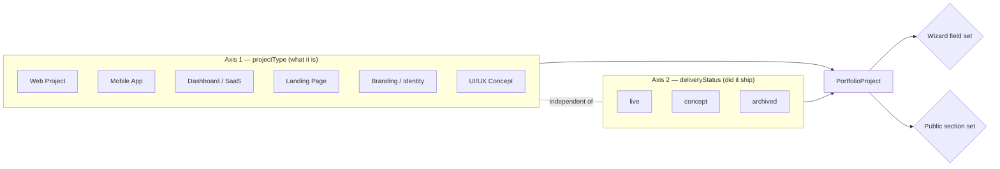
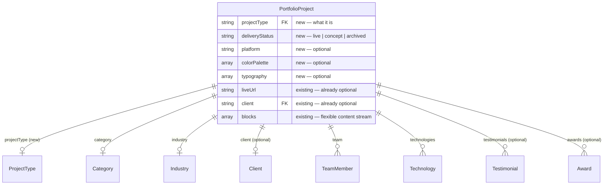

# PROJECT_REVIEW — Design Showcase / UI-Only Work Strategy

**Author:** Lead Product Architect (review pass, no code changes)
**Date:** 2026-08-06
**Scope:** Should UI-only design work (concepts, mobile app designs, dashboards, landing pages with no live URL) live inside the existing Portfolio system, and if so, how.

> This review is grounded in the actual codebase, not a generic answer. Every recommendation below cites the real file/field it builds on. Where I disagree with the literal wording of the brief (e.g. "Project Type" as a single flat field), I explain why and propose the sharper version.

---

## 0. Executive Summary (read this first)

**Keep one unified Project system. Do not build a separate Design Gallery.** Add one new field-pair — `projectType` (what it is) and `deliveryStatus` (is it live) — and make the existing wizard and public detail page *type-aware*, reusing infrastructure that already exists and is already 80% of the way there.

Three facts from the codebase drive this recommendation:

1. **The schema was already built for this.** `PortfolioProject` (`server/models/PortfolioProject.js`) already has an optional `client`, an optional `liveUrl`, `confidential`/`private` flags, and a doc comment explicitly rejecting the "add thirty more top-level fields" approach in favor of narrative fields that "render only when present." Someone already designed this model to support client-less, live-URL-less work. It just hasn't been surfaced in the UI yet.
2. **Device-chrome mockups already exist.** `blockSchema.frame` supports `'none' | 'browser' | 'mobile' | 'tablet'` — the exact device-mockup presentation a UI-concept or mobile-app design needs — sitting unused for this purpose today.
3. **You already have a cautionary tale for the "separate system" option**, and it's live in this repo right now: `CaseStudies.jsx` / `CaseStudyDetail.jsx` render from a hardcoded static file (`client/src/data/caseStudies.js`), completely disconnected from the real CMS (`PortfolioProject` + `/api/portfolio` + the admin wizard). It's a second, parallel, un-synced content system — exactly the failure mode Option B below would recreate on purpose. Flagged as backlog debt in §11.

Read on for the full reasoning per question.

---

## 1. Is this a good idea?

**Yes — with one caveat: the problem you're actually solving is *trust and labeling*, not *data modeling*.**

You said it yourself: *"I don't want visitors to think they are fake projects... I also don't want them to look unfinished."* That's not a schema problem. A visitor doesn't distrust a project because it lives in the same database table as a client case study — they distrust it because the page pretends to be something it isn't (a dead "Visit Live Site" button, a client name that doesn't exist, a results section with fabricated metrics). The fix is **honest, confident presentation of design work as its own category**, not hiding it in a separate system or dressing it up as a live product.

### Should UI-only work live in the same Projects system?

**Yes.** Reasoning:

| | Unified system (recommended) | Separate system |
|---|---|---|
| Bilingual (AR/RTL) infrastructure | Reused as-is | Must rebuild or duplicate |
| Media pipeline (Cloudinary, `Media` catalog, ref-counting, SVG sanitization) | Reused as-is | Must rebuild or duplicate |
| Admin UX (wizard, `RelationPicker`, libraries, SEO section) | Reused as-is | Must rebuild or fork |
| Search / filter / related-projects | One index, one algorithm | Two indexes, two algorithms, or none for the new system |
| Visitor mental model | One portfolio, filterable by type | Two destinations to discover and cross-check |
| Admin mental model | One "Add Project" button, one skill to learn | Two content types, two workflows, decision fatigue on every new entry |
| Long-term maintenance | One schema evolves | Two schemas drift apart (see `CaseStudies.jsx` precedent below) |
| A concept later becomes a real client project | Flip `deliveryStatus`, add `liveUrl` — done | Migrate the whole record between systems |

### Advantages of unifying
- **One content operations loop.** Every improvement (new block type, better SEO schema, better related-projects logic, Story Quality Meter) benefits *all* project types forever, not just the ones built after the decision.
- **Cross-pollination in the UX.** A visitor filtering by "Fintech" or "Mobile" sees your best work regardless of whether it shipped — which is usually what a prospect actually wants to evaluate ("can this team design at this level"), not "does this team only show me things that are live."
- **Growth path for the work itself.** UI concepts are frequently *unshipped client pitches* or *the seed of a future shipped product*. A unified model lets a project's status evolve without a data migration.
- **Already-proven architecture pattern.** `Category`, `Industry`, `Client`, `Technology`, `Service`, `Award`, `Testimonial`, `TeamMember`, `Tag` are all reusable, admin-manageable "libraries" behind one generic CRUD factory (`server/routes/libraryRouter.factory.js`). Adding "Project Type" as a 10th library is a same-shaped, low-risk change, not new architecture.

### Disadvantages / risks (and mitigations)
- **Risk: fields that don't apply get shown anyway, looking sloppy.** → Mitigate with type-aware progressive disclosure in the wizard (§4) and type-aware conditional rendering in the detail page (§6) — the codebase already renders sections conditionally based on data presence; this extends the same pattern to be type-aware, not a new mechanism.
- **Risk: "real work" and "concept work" blur together and undermine credibility.** → Mitigate with an explicit, confident type badge everywhere the project appears (card, hero, meta) — see §5/§11. Transparency, not disguise, is what preserves trust.
- **Risk: schema creep if every new type invents its own fields.** → Mitigate by reusing existing narrative fields with type-aware *labels* instead of adding new fields per type (see §9) — matches the existing schema-comment philosophy of preferring a bounded field set + flexible blocks over ad hoc top-level fields.

**Verdict: proceed with one system.** The rest of this report designs that system.

---

## 2. Best Architecture

**Recommendation: Option A, done precisely — "One unified Project system, with an explicit, admin-managed Project Type + a decoupled Delivery Status, both driving progressive disclosure in the editor and conditional rendering on the public page."**

This is deliberately *not* a flat merge (naive Option A, where every project shows every field regardless of relevance) and *not* Option B (a separate Design Gallery). Call it **Option A′**.

### Why not Option B (separate Design Gallery)?
Because you already have one, unintentionally, and it's a maintenance liability today: `CaseStudies.jsx` reads `CASE_STUDIES` from a static JS file, `Portfolio.jsx`/`PortfolioDetail.jsx` read from `PortfolioProject` via `/api/portfolio`. Two content sources, two card designs, two detail-page layouts, one of them not editable from the admin at all. This is exactly what "Design Gallery" would become in twelve months: a second thing to keep in sync, that quietly falls out of sync, that a future audit finds and has to reconcile (see the [CMS Library Normalization](server/media/mediaCatalog.service.js) work already done to *undo* this kind of fragmentation elsewhere in the project). Don't rebuild the problem you already have evidence against.

### Why not naive Option A (one system, no type distinction)?
Because "Client," "Live URL," "Results," "Testimonial," "KPIs" are all *meaningless or actively dishonest* on a self-directed UI concept. Showing empty/N-A versions of these fields is precisely the "looks unfinished / looks fake" problem you're trying to avoid. A flat model either forces fake data into those fields (bad) or ships visibly empty sections (bad). You need a discriminator.

### The discriminator is two orthogonal fields, not one
The brief's phrasing ("Project Type: Web / Mobile / Dashboard / UI Concept / Landing Page / Branding") conflates two different questions:

1. **What kind of deliverable is it?** → `projectType` (Web Project, Mobile App, Dashboard/SaaS, Landing Page, Branding/Identity, UI/UX Concept, ...)
2. **Did it ship as a real, visitable product?** → `deliveryStatus` (`live` | `concept` | `archived`)

These are independent axes. A "Mobile App" can be a **live** shipped app *or* an unshipped **concept**. A "Web Project" can be a live client site *or* a concept redesign pitch that was never approved. Collapsing both into one `projectType` enum (with "UI Concept" as just another category value) forces awkward choices — e.g. is a live fintech dashboard "Dashboard" or should it also be tagged "UI Concept" because the visual design is also great? Two fields resolve this cleanly, and it's a small addition, not new architecture — it mirrors the existing `status` (draft/published/archived — a *publishing* state) already living alongside other classification fields on the same model. `deliveryStatus` is the same idea applied to "did this ship," not "is this published."



### Where this plugs into the existing architecture
- `projectType` → new library, `server/models/ProjectType.js`, mounted through the exact same `createLibraryRouter` factory as `Category`/`Industry`/`Service` (`server/routes/libraries.routes.js`). Zero new backend patterns.
- `deliveryStatus` → a plain enum field directly on `PortfolioProject`, same shape as the existing `status` field.
- Both become new facets on the public `/portfolio` filter bar, which already filters by category/industry/technology (`Portfolio.jsx`).
- Both become new inputs to the wizard's conditional rendering, which already exists in spirit (`StoryQualityMeter.jsx`, and the "sections render only when present" doc comment on `PortfolioProject`).

---

## 3. Data Model

### New fields on `PortfolioProject`

| Field | Type | Notes |
|---|---|---|
| `projectType` | `ObjectId` ref → new `ProjectType` library | Admin-managed, like `Category`. Seed with: Web Project, Mobile App, Dashboard/SaaS, Landing Page, Branding/Identity, UI/UX Concept. Extensible without a code deploy. |
| `deliveryStatus` | `String` enum: `'live' \| 'concept' \| 'archived'` | Default `'live'` for backward compatibility with all existing published projects (they're all real client work today). `'archived'` covers a formerly-live product that's since been taken down — still real, shouldn't claim "concept." |
| `platform` | `String` enum: `'web' \| 'ios' \| 'android' \| 'cross-platform' \| 'desktop'`, optional | Relevant mainly for Mobile App / Dashboard types; drives device-frame choice in the gallery (see §5/§6). |
| `colorPalette` | `[{ hex: String, name: String, nameAr: String }]`, optional | Small structured array — swatches + names, e.g. `{ hex: '#2563EB', name: 'Primary Blue' }`. |
| `typography` | `[{ role: String, fontFamily: String, weight: String }]`, optional | e.g. `{ role: 'Heading', fontFamily: 'Inter', weight: '700' }`, `{ role: 'Body', fontFamily: 'Inter', weight: '400' }`. |
| `behanceUrl`, `dribbbleUrl` | `String`, optional | Same shape as the existing `figmaUrl`/`githubUrl` — plain optional link fields, nothing new architecturally. |
| `downloadAsset` | `mediaAssetSchema`, optional | A PDF case-study deck or a zip of source files — reuses the existing `Media` catalog and `GENERIC_FILE_MIMES` (PDF/doc/zip already allow-listed in `server/media/mediaConstants.js`). |

### Fields that stay exactly as they are (already correctly optional)
Confirmed by reading the schema directly — **no migration needed, these already support UI-only work today**:
- `client` — already an optional `ObjectId` ref, not `required`.
- `liveUrl` — already optional.
- `description`/`coverImage` — enforced only at publish time (`assertPublishable` guard in `portfolio.routes.js`), not at draft-save time, which is exactly right for a progressive editor.
- `confidential` / `private` — already exist for NDA'd or hidden work; unrelated to but compatible with the concept/live distinction.
- The narrative fields (`myRole`, `goals`, `painPoints`, `challenge`, `solution`, `process`, `results`) and the proof fields (`metrics`, `performanceMetrics`, `testimonials`, `faqs`, `awards`) are **all already optional and already documented to "render only when present."** Nothing to change at the schema level here — the work is entirely in *labeling* them per type (§9), not adding new fields.

### Should fields become optional / should sections disappear by type?

**At the schema level: no further changes needed** — Mongoose/MongoDB already tolerates unset fields, and the model's philosophy (per its own doc comments) is deliberately "bounded core fields, all optional, plus a flexible `blocks[]` stream" rather than a rigid per-type schema. Don't fight that; extend it.

**At the UI level: yes, absolutely** — both the admin wizard (§4) and the public detail page (§6) should hide fields/sections that don't apply to the current `projectType`/`deliveryStatus` combination. This is a *presentation-layer* decision driven by the two new fields, not a data-modeling one. That split (flexible storage, opinionated rendering) is the same split the block-content system already uses.

### Entity relationship (delta only — existing libraries omitted for clarity)



---

## 4. UX Flow — Creating a Design Showcase

### Step 0 (new): Type selection gate
Clicking **Create Project** first shows a type picker (visual cards, not a dropdown — this is the moment that sets expectations for the rest of the wizard):

```
┌─────────────┐ ┌─────────────┐ ┌─────────────┐ ┌─────────────┐
│  🌐 Web     │ │  📱 Mobile  │ │  🖥 Dashboard│ │  🎯 Landing │
│  Project    │ │  App        │ │  / SaaS      │ │  Page       │
└─────────────┘ └─────────────┘ └─────────────┘ └─────────────┘
┌─────────────┐ ┌─────────────┐
│  🎨 Branding│ │  ✏️ UI/UX   │
│  / Identity │ │  Concept    │
└─────────────┘ └─────────────┘
```
Selecting a type sets `projectType` and pre-selects a sensible default `deliveryStatus` (Web/Mobile/Dashboard/Landing → default "Live," user can flip to "Concept"; Branding/UI Concept → default "Concept," user can flip to "Live" if it's an unshipped-but-real client identity project). This is a default, never a lock — every field stays editable afterward.

### Full field list for a `UI/UX Concept` project (the wizard's existing `SectionNav` sections, adapted)

**Overview section** (extends the existing `OverviewSection.jsx`):

| Field | Why it exists |
|---|---|
| Cover Image * | Required to publish (existing rule) — first impression on the grid. |
| Cover Video (optional) | Existing field — a scroll-through screen-recording sells a concept better than a static frame. |
| Title / Title (Arabic) | Existing, required. |
| Tagline / Tagline (Arabic) | Existing — one-line pitch, shown under the title. |
| **Project Type** (new) | Sets the whole adaptive field/section set; shown as a badge everywhere the project appears. |
| **Delivery Status** (new) — Live / Concept / Archived | Drives the Live URL / CTA logic (§7) and the trust-signaling badge (§5/§11). This is the single most important new field for solving the "don't look fake" problem. |
| Category | Existing — still applies; a concept is still "E-commerce" or "Fintech" etc. |
| **Platform** (new, shown only for Mobile App / Dashboard) | Drives which device frame (`browser`/`mobile`/`tablet`) is used to present the gallery. |
| Industry | Existing, optional. |
| Client — *shown but explicitly optional, with a "This is a self-directed / concept project" skip affordance* | Already optional in the schema; the wizard should make skipping it feel intentional, not like an incomplete form (see §8). |
| Year, Duration, Team size, Launch date | Existing — a concept still has a "when I made this," even without a launch. |
| Our Role | Existing. |
| Services | Existing — a Branding concept still maps to "Brand Identity," "Logo Design" services in the library. |
| **Tools Used** | Reuses the existing `technologies` library as-is — it's just named/tagged entries (e.g. "Figma," "Photoshop," "Illustrator," "Framer") no different in shape from "React"/"Node." No schema change required, just seed the library with design-tool entries. |
| Tags | Existing `projectTags`. |

**Media section** (extends `MediaSection.jsx`):

| Field | Why it exists |
|---|---|
| Gallery (ordered, multi-image/video) | Existing — becomes the *primary* showcase for concept work (no live site to link to), so it should get first billing on the detail page for this type (§6). |
| **Color Palette** (new) | Swatches with names — a standard, expected artifact in any UI-design showcase; also doubles as a nice, scannable visual element on the detail page. |
| **Typography** (new) | Font pairing + roles — same rationale as palette; both are cheap structured data that read as "this was a real, considered design," directly addressing the "doesn't look unfinished" goal. |

**Story section** (reuses `StorySection.jsx` / `BlocksEditor.jsx` — labels adapt per type, see §9):
- Design Brief (maps to existing `goals`/`goalsAr`)
- Constraints (maps to existing `painPoints`/`painPointsAr`)
- Design Rationale (maps to existing `challenge`/`solution`)
- Process (existing `process`, plus free-form `blocks[]` — this is where the `frame: 'mobile'/'browser'/'tablet'` device-mockup blocks do the heavy lifting)
- Outcome / Learnings (existing `results` — reframed as reflection, not fabricated business impact)

**Proof/Results section** (`ProofResultsSection.jsx`) — **hidden by default for `deliveryStatus: concept`**, since metrics/KPIs/testimonials require a real engagement to be honest. Left available to fill in manually for the (common) case of an unshipped *client* pitch that does have a real testimonial about the design process itself.

**Links** (extends the existing Links block in `OverviewSection.jsx`):

| Field | Why |
|---|---|
| Live URL | Existing — hidden from the public page entirely when `deliveryStatus ≠ 'live'` (§7), but the field itself stays available in case the project later ships. |
| Figma | Existing. |
| **Behance** (new) | Standard design-portfolio distribution channel. |
| **Dribbble** (new) | Same. |
| **Download** (new) | Optional PDF/zip via the existing generic-file media pipeline — a downloadable case-study deck or source files. |

**SEO/Publish section** (`SeoPublishSection.jsx`, unchanged) + **Private/Confidential/Featured** switches (existing, unchanged — these already work for any project type).

---

## 5. Public Portfolio (grid/card design)

The existing `PortfolioCard` component and grid (`Portfolio.jsx`) stay as the single grid for everything. Changes are additive, not structural:

- **Type badge** — small icon + label pill on the card (🌐 Web · 📱 App · 🖥 Dashboard · 🎨 Concept), same visual weight as a category tag. This is the confidence move: label it clearly rather than hide it. A well-designed "Concept" badge reads as *another category of excellent work*, not a disclaimer.
- **Client line fallback** — currently client name/logo presumably renders when present; when `client` is empty, show nothing (not "N/A", not blank whitespace) — see §8.
- **Live indicator** — a small dot/label only appears when `deliveryStatus === 'live'`, replacing any implicit assumption that every card links to a real site.
- **Filter bar** — add `Project Type` and `Delivery Status` as new filter chips alongside the existing Category/Industry/Technology/Sort filters already in `Portfolio.jsx`. This lets a visitor self-select "show me shipped work only" or "show me design explorations" — solving the trust question with a UI affordance instead of a data-hiding decision.

### Gallery / Hero / Carousel — by type
This is where the **already-existing `frame: 'none' | 'browser' | 'mobile' | 'tablet'` block type** (`server/models/PortfolioProject.js` → `blockSchema`) should be leaned on hard, because it's already built and unused for this purpose:

| Project type | Recommended primary presentation |
|---|---|
| Web Project / Dashboard | `frame: 'browser'` mockups — screenshot inside a browser chrome, exactly what already exists. |
| Mobile App | `frame: 'mobile'` mockups, ideally a horizontal-scroll carousel of 3–5 screens (device frame already built). |
| Landing Page | `frame: 'browser'`, full-bleed scroll-capture image preferred over a static screenshot. |
| UI/UX Concept | **No device frame by default** — bare, large-format image grid + lightbox. A concept isn't a "browser window," and forcing a device chrome around a dashboard exploration or a design-system sheet looks like a category error. Use `frame: 'none'`. |
| Branding/Identity | Bare image grid + a dedicated palette/typography block — logos and identity marks never belong in a browser frame. |

- **Fullscreen preview** — the existing `Lightbox.jsx` already provides this; reuse as-is for every type.
- **Image grid vs. carousel** — grid for exploratory/branding work (visitor scans many artifacts at once), carousel/scroll-driven for flows (mobile app screens, a landing page's scroll narrative) — both patterns already exist in the codebase (`Gallery.jsx`, `Lightbox.jsx`) and just need type-aware layout selection, not new components.

---

## 6. Project Details Page

No new page — **type-aware conditional rendering of the existing section stack** (`client/src/components/portfolio-detail/PortfolioDetailView.jsx`), which already composes: `Hero → StoryBeats → ProcessBand → BlockRenderer → ImpactSection → ProofSection → Gallery → FAQSection → NextProject → CTASection`.

| Section (existing component) | Live client project | UI Concept |
|---|---|---|
| `Hero.jsx` | Title, tagline, client logo, primary CTA = "Visit Live Site" | Title, tagline, **type badge**, primary CTA = best available of Figma/Behance/Dribbble/Download (see §7) — never a dead button |
| `StoryBeats.jsx` (challenge/solution/process/results) | Labeled as-is | Same fields, **relabeled** "Design Brief / Rationale / Process / Outcome" (§9) — no new fields |
| `ProcessBand.jsx` | As-is | As-is — process narrative applies to any type |
| `BlockRenderer.jsx` | As-is, browser-frame heavy | As-is, frame-light/bare-image heavy (§5) |
| **Color Palette** (new small section) | Optional, rarely filled | Commonly filled — a standard expectation for design work |
| **Typography** (new small section) | Optional | Commonly filled |
| `ImpactSection.jsx` (metrics/performance) | Shown when data present (already conditional) | **Hidden** — no schema change needed, simply not filled in for concept work, which the section already handles gracefully |
| `ProofSection.jsx` (testimonials/proof screenshots) | Shown when present | Hidden unless a real design-process testimonial exists |
| `Gallery.jsx` | Supporting section, mid-page | **Promoted** — for concept work with no live product, the gallery *is* the product; give it first visual billing right after the hero, not buried mid-page |
| `FAQSection.jsx` | As-is | As-is, or omitted if empty (already conditional) |
| `NextProject.jsx` / related rail | Already driven by category/industry matching (`relatedProjectsOverride` fallback algorithm) | Same algorithm; consider adding `projectType` as an additional relatedness signal so concept work surfaces other concept work, not just by category |
| `CTASection.jsx` | Generic "Start your project" CTA | Same CTA generalizes fine — a concept page converting a visitor into a "I want this quality of design" lead is *exactly* the commercial value of showing concept work (see §11) |

No new page shell, no new routing — this is entirely `if (deliveryStatus/projectType) { ... }` branching inside components that already branch on data presence today.

---

## 7. Live URL Behavior

**Hide it — never show a disabled/greyed-out button, never show "Coming soon."** Both of those read as broken or stalled, which is worse than the honest alternative. This mirrors a pattern already established elsewhere in the schema: the `video` block explicitly documents "`asset` OR `embedUrl`, never both" — an either/or philosophy already native to this codebase. Apply the same either/or logic to the hero CTA:

```
CTA priority when deliveryStatus !== 'live':
  1. figmaUrl        → "View in Figma"
  2. behanceUrl       → "View on Behance"
  3. dribbbleUrl       → "View on Dribbble"
  4. downloadAsset     → "Download Case Study"
  5. none of the above → no CTA button at all; gallery is the experience
```

This is strictly better than a single fallback: it always shows the *most actionable* link available, and gracefully degrades to "no button" rather than ever faking one. When `deliveryStatus === 'live'`, `liveUrl` keeps its current primary-CTA position unchanged.

---

## 8. Client Field

**Already optional at the schema level** — confirmed directly in `server/models/PortfolioProject.js`: `client: { type: ObjectId, ref: 'Client' }`, no `required: true`. No backend change needed here.

Two small UI polish items (not schema changes):
1. **Wizard**: make the empty state read as a deliberate choice, not an incomplete field — e.g. a "No client — self-directed / concept project" affordance next to the picker, rather than a bare empty `RelationPicker`.
2. **Public detail page**: when `client` is empty, the "Client" line/section must be omitted entirely, not rendered as blank or "N/A." Worth a quick self-review pass on `Hero.jsx`/`PortfolioDetailView.jsx` to confirm this is already the behavior — the pattern exists elsewhere in this codebase (`confidential` already swaps the client block for a generic category+industry line rather than showing broken data), so it's a small, low-risk check, not new logic to invent.

---

## 9. Case-Study Fields (Problem / Goals / KPIs / Testimonials / Results / SEO)

**Recommendation: keep the exact same schema fields for every type. Do not add parallel "concept" narrative fields.** This matches the model's own stated design philosophy (its doc comment explicitly rejects "add thirty more top-level fields" duplicating near-identical concepts). Instead:

- **Reuse, don't duplicate, at the field level:**
  - `goals`/`goalsAr` → labeled "Business Goals" for live work, "Design Brief" for concept work.
  - `painPoints`/`painPointsAr` → "Client Pain Points" vs. "Constraints."
  - `challenge`/`solution` → "Challenge/Solution" vs. "Design Rationale."
  - `results`/`resultsAr` → "Results" vs. "Outcome & Learnings."
  - This is purely a label lookup keyed by `projectType`/`deliveryStatus`, resolved at render time in both the wizard and the public page — no new fields, no migration.
- **`metrics`, `performanceMetrics`, `testimonials`, `awards`** → leave optional exactly as they are today. For concept work, simply don't fill them in; `ImpactSection.jsx`/`ProofSection.jsx` already render conditionally. Do **not** invent fake placeholder KPIs to "fill the section" — that's precisely the fabrication that would make concept work look dishonest instead of confident.
- **`faqs`** → applies equally well to either type as-is (e.g. "Why wasn't this shipped?" is a legitimate, honest FAQ entry for a concept project).
- **SEO fields (`metaTitle`/`metaDescription`)** → always keep, unconditionally, for every type. SEO is orthogonal to whether the work shipped.

**Net result: zero new narrative fields.** The only schema additions in this whole review are the classification fields (`projectType`, `deliveryStatus`, `platform`) and the design-specific artifacts (`colorPalette`, `typography`, `behanceUrl`, `dribbbleUrl`, `downloadAsset`) — everything else is presentation-layer label/visibility logic on fields that already exist.

---

## 10. Future Scalability (100 → 300 → 1000+ projects)

**The current architecture scales fine to 1000+; the two things that would actually break are unrelated to this feature and worth flagging now.**

What already scales correctly:
- Libraries (`Client`, `Technology`, `Category`, etc.) are references, not embedded strings — 1000 projects referencing the same `Client` doc costs one row, not 1000 copies. Adding `ProjectType` as an 11th library follows the identical pattern.
- Indexes already exist for the access patterns that matter: `{ status: 1, order: 1, createdAt: -1 }`, `{ status: 1, featured: 1 }`, a text index on title/description, and `{ createdAt: -1, _id: -1 }` for cursor pagination — meaning the public listing already avoids the classic "skip/limit on a huge collection" performance cliff.
- Media is stored via Cloudinary + a reference-counted `Media` catalog (`server/media/mediaCatalog.service.js`), so image/video storage scales independently of Mongo document size or count.
- Filtering/search on the public grid is already query-param driven against indexed fields, not client-side array filtering — adding `projectType`/`deliveryStatus` as two more indexed filter fields is a linear, low-risk extension: extend the compound index to `{ status: 1, projectType: 1, featured: 1 }` once the catalog is large enough that the filter is heavily used.

What would **not** scale past a few hundred, and should be fixed regardless of this feature:
- **Manual `order` field for sort position.** A hand-maintained integer order across 1000+ documents becomes unmanageable in the admin UI (drag-reordering a 1000-row list is not a real workflow). Recommend: algorithmic default sort (featured first, then `publishedAt` desc) for the general catalog, and reserve manual drag-reorder for a small **curated "Featured" subset only** (e.g. top 12–20), which is what `featured` already exists to support.
- **The `CaseStudies.jsx` static-data system** (§0, §11) doesn't scale at all — it's hand-edited source code, not a database. It should not receive any of the type/status work in this review; it should be retired.

At 1000+ projects, also expect to need (standard CMS-scale concerns, not urgent today): admin-side pagination/virtualization on the project list table, and a lightweight moderation/review state if more than one editor is publishing (the existing `AuditLog` already gives a trail to build that on top of, if needed later).

---

## 11. Missing Ideas — beyond the brief

1. **Retire the legacy `CaseStudies.jsx` static system.** Found during this review: `client/src/pages/CaseStudies.jsx` and `CaseStudyDetail.jsx` render from a hardcoded `client/src/data/caseStudies.js`, entirely separate from `PortfolioProject`/`/api/portfolio`/the admin wizard. This is dead weight and a direct precedent for the "two systems drift apart" risk this whole review argues against. Recommend a follow-up task to migrate any still-relevant content into `PortfolioProject` and delete the static system and its route.
2. **Lean into the "Concept" label as a strength, not a disclaimer.** Agencies whose design quality is the pitch (Linear, Framer, top-tier studios) run dedicated "Explorations" or "Concepts" sections proudly, often as some of their most-viewed portfolio pieces. A confident type badge + a short one-line honesty note ("Self-directed design exploration — not a live commercial engagement") on concept pages will read as *more* credible than silence, directly solving the "don't want them to look fake" worry through transparency rather than concealment.
3. **Extend `StoryQualityMeter.jsx`** (already built for the admin wizard) to be type-aware — a concept project shouldn't be scored as "incomplete" for having no KPIs/testimonials filled in; its 100%-complete bar should reflect a different, type-appropriate field checklist.
4. **Add `projectType` to the related-projects matching signal** (`relatedProjectsOverride` fallback algorithm) so a visitor viewing a UI concept sees other concept/design work first, not just same-category live client sites.
5. **Turn a concept page into a lead-gen moment.** The existing `CTASection.jsx`/`ProjectRequestForm` already exists — surface copy specific to the viewed `projectType` ("Want a mobile app designed to this standard? Let's talk") rather than a generic CTA, since concept pages are effectively a service-capability pitch.
6. **A richer disclosure than a binary badge**, for the (common) case of unshipped *real* client pitches: a short optional `disclosureNote` free-text field ("Unreleased client pitch," "Personal project," "Design exploration") gives more honest nuance than a three-value enum alone, without adding real schema complexity.
7. **Iteration/version linking.** Concept work is often iterative (v1/v2 redesign explorations of the same idea). The existing `relatedProjectsOverride` array is already the right primitive to link sibling iterations manually — worth calling out explicitly in the wizard UX for concept projects specifically.
8. **Accessibility check on the gallery-first concept layout.** Since §6 recommends promoting `Gallery.jsx`/`Lightbox.jsx` to primary billing for concept pages, it's worth a focused a11y pass on `Lightbox.jsx` (keyboard nav, focus trap, screen-reader labeling) before it becomes the primary experience for an entire project type — this codebase has previously had a real admin-modal focus-trap bug found in self-review, so it's a known risk category worth checking rather than assuming.
9. **PDF/print export**, for a downloadable one-pager version of a concept case study — bigger scope, worth a "nice to have, later" note rather than building now; the `downloadAsset` field in §3 covers the manual-upload version of this today.

---

## Final Recommendation

Ship **Option A′**: one unified `PortfolioProject` system, two new classification fields (`projectType` as a library, `deliveryStatus` as an enum), a handful of design-specific optional fields (`colorPalette`, `typography`, `platform`, `behanceUrl`, `dribbbleUrl`, `downloadAsset`), zero new narrative fields (relabel existing ones instead), and type-aware conditional rendering in both the admin wizard and the public detail page — extending patterns (conditional sections, the generic library factory, the existing device-frame block types) that already exist in this codebase rather than introducing new ones. Retire the legacy static `CaseStudies` system as a related but separate cleanup item.

This gets you a portfolio that can proudly show 1000+ pieces of work — shipped and unshipped — under one roof, one admin workflow, and one visual language, with the "is this real" question answered by confident labeling rather than by keeping two systems or hiding half the work.
